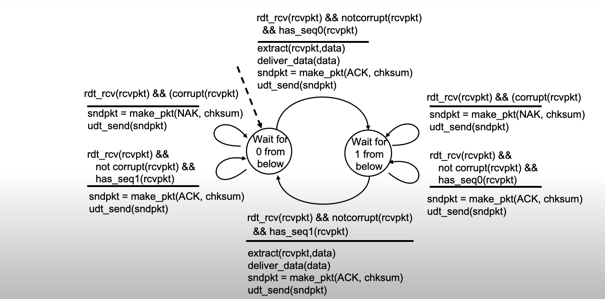
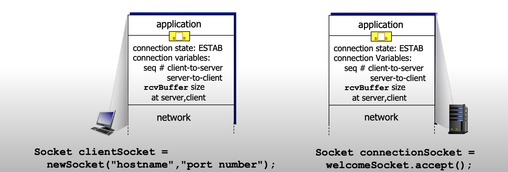
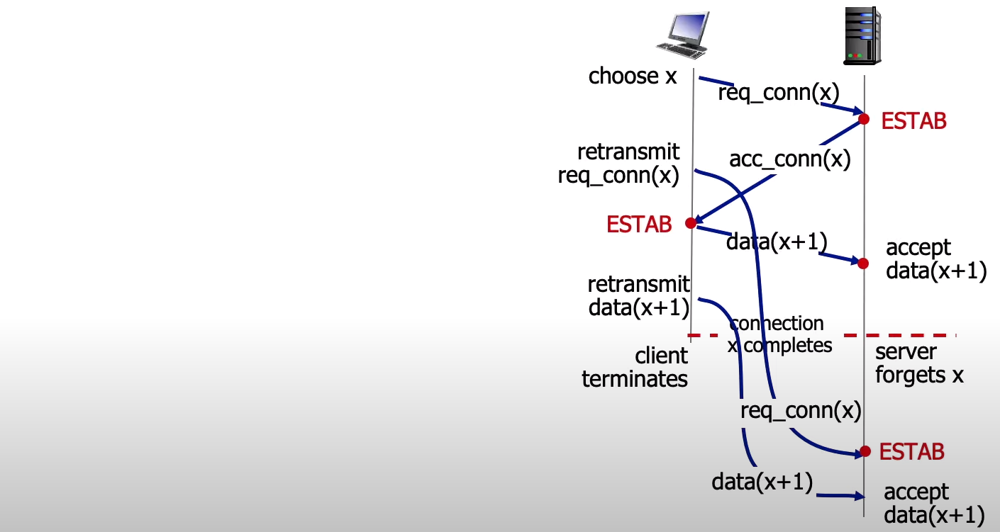
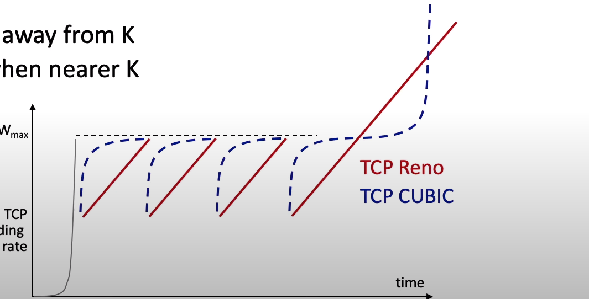

# Lecture 3. Transport Layer

## Lecture 3.1 Introduction and Transport-layer Services

### Transport services and protocols
- provide **logical communication** between application processes running on different hosts
- transport protocols actions in end systems:
  - sender: breaks application messages into **segments**, passes to network layer
  - receiver: reassembles segments into messages, passes to application layer
- two transport protocols available to Internet applications
  - TCP, UDP


### Transport vs. network layers services and protocols
#### household analogy:
12 kids in Ann's house sending letters to 12 kids in Bill's house:
- hosts = houses
- processes = kids
- app messages = letters in envelopes
- transport protocol = Ann and Bill who demux to in-house siblings
- network-layer protocol = postal service


- network layer: logical communication between **hosts**
- transport layer: logical communication between **processes**
  - relies on, enhances, network layer services

### Transport Layer Actions
Sender:
- is passes an application-layer message
- determines segment header fields values
- creates segment
- passes segment to IP

Receiver:
- receives segment from IP
- checks header values
- extracts application-layer message
- demultiplexes message up to application via socket

### Two principal Internet transport protocols
- **TCP**: Transmission Control Protocol
  - reliable, in-order delivery
  - congestion control
  - flow control
  - connection setup
- **UDP**: User Datagram Protocol
  - unreliable, unordered delivery
  - no-frills extension of "best-effort" IP
- services not available:
  - delay guarantees
  - bandwidth guarantees

## Lecture 1.2 Multiplexing and demultiplexing


### Multiplexing / demultiplexing in UDP
**multiplexing at sender:**

handle data from multiple sockets, add transport header (later used for demultiplexing)

**demultiplexing at receiver:**

use header info to deliver received segments to correct socket

### How demultiplexing workds?
- host receives IP datagrams
  - each datagram has source IP address, destination IP address
  - each datagram carries one transport-layer segment
  - each segmnet has source, destination port number
- host uses **IP addresses & port numbers** to direct segment to appropriate socket


### Connectionless demultiplexing

Recall:
- when creating socket, must specify **host-local** port #:

```
DatagramSocket mySocket1 = new DatagramSocket(12534);
```

- when creating datagram to send into UDP socket, must specify
  - destination IP address
  - destination port #


when receiving host receives UDP segment:
- checks destination port # in segment
- directs UDP segment to socket with that port #

IP / UDP datagrams with **same dest. port #**, but different source IP addresses and/or source port numbers will be directed to **same socket** at receiving host

### Connectionless demultiplexing: an example


### Connection-oriented demultiplexing
- TCP socket identified by 4-tuple:
  - source IP address
  - source port number
  - dest IP address
  - dest port number
- demux: receiver uses **all four values** (4-tuple) to direct segment to appropriate socket

- server may support many simultaneous TCP sockets:
  - each socket identified by its own 4-tuple
  - each socket associated with a different connecting client

### Connection-oriented demultiplexing: example


These segments, all destined to IP address: B,
dest port: 80 are demultiplexed to **different** sockets.

### Summary
- Multiplexing, demultiplexing: based on segment, datagram header field values
- **UDP:** demultiplexing using destination port number (only)
- **TCP:** demultiplexing using 4-tuple: source and destination IP addresses, and port numbers
- Multiplexing / demultiplexing happen at **all** layers

## Lecture 3.3 Connectionless Transport: UDP

### UDP: User Datagram Protocol
- "no frills", "bare bones" Internet transport protocol
- "best effort" service, UDP segments may be:
  - lost
  - delivered out-of-ordered to app
- **connectionless:**
  - no handshaking between UDP sender, receiver
  - each UDP segment handled independently of others

**Why is there a UDP?**

- no connecetion establishment (which can add RTT delay)
- simple: no connection state at sender, receiver
- small header size
- no congestion control
  - UDP can blast away as fast as desired!
  - can function in the face of congestion

- UDP use:
  - streaming multimedia apps (loss tolerant, rate sensitive)
  - DNS
  - SNMP
  - HTTP/3
- if reliable transfer needed over UDP (e.g., HTTP/3):
  - add needed reliability at application layer
  - add congestion control at application layer

UDP defined in RFC 768 (only 3 pages).

### UDP: Transport Layer Actions

UDP sender actions:
- is passed an application-layer message
- determines UDP segment header fields values
- creates UDP segment
- passes segment to IP

UDP receiver actions:
- receives segment from IP
- checks UDP checksum header value
- extracts application-layer message
- demultiplexes message up to application via socket

### UDP segment header


### UDP checksum
**Goal:** detect errors (i.e., flipped bits) in transmitted segment

**sender:**
- treat contents of UDP segment (inclluding UDP header fields and IP addresses) as sequence of 16-bit integers
- **checksum:** addition (one's complement sum) of segment content
- checksum value put into UDP checksum field

**receiver:**
- compute checksum of received segment
- check if computed checksum equals checksum field value:
  - Not equal - error detected
  - Equal - no error detected. But maybe errors nonetheless.


### Internet checksum: weak protection!
Certain errors (or combination of errors) can't be detected.

### Summary: UDP
- "no frills" protocol:
  - segment may be lost, delivered out of order
  - best effort service: "send and hope for the best"
- UDP has its plusses:
  - no setup/handshaking needed (no RTT incurred)
  - can function when network service is compromised
  - helps with reliability (checksum)
- build additional functinoality on top of UDP in application layer (e.g., HTTP/3)

## Lecture 3.4-1 Principles of Reliable Data Transfer


Notice that abstraction has unidirectional channel, where the implementation uses bidirectional.

Sender, receiver do not know the "state" of each other, e.g., was a message received?
- unless communicated via a message

### Reliable data transfer protocol (rdt): interfaces


**We will:**

- incrementally develop sender, receiver sides of reliable data transfer protocol (rdt)
- consider only unidirectional data transfer
  - but control info will flow on both directions!
- use finite state machines (FSM) to specify sender, receiver


### rdt1.0: reliable transfer over a reliable channel
- underlying channel perfectly reliable
  - no bit errors
  - no loss of packets
- **separate** FSMs for sender, receiver:
  - sender sends data into underlying channel
  - receiver reads data from underlying channel


### rdt2.0: channel with bit errors

- underlying channel may flip bits in packet
  - checksum (e.g., Internet checksum) to detect bit errors
- the question: how to recover from errors?

**How do humans recover from "errors" during conversation?**

Yes, I understand.

I'm not sure I understand.

**back to rdt2.0**

**the question: how to recover from errors?**
- **acknowledgements (ACKs):** receiver explicitly tells sender that pt received OK
- **negative acknowledgements (NAKs):** receiver explicitly tells sender that pkt had errors
- sender **retransmits** pkt on receipt of NAK

**stop and wait**

sender sends one packet, then waits for receiver response.

### rdt2.0: FSM specifications


### rdt2.0 has a fatal flaw!
**what happens if ACK/NAK corrupted?**
- sender doesn't know what happened at receiver!
- can't just retransmit: possible duplicate

**handling duplicates:**

- sender retransmits current pkt if ACK/NAK corrupted
- sender adds **sequence number** to each pkt
- receiver discards (doesn't deliver up) duplicate pkt

### rdt2.1: sender, handling garbled ACK/NAKs


### rdt2.1: receiver, handling garbled ACK/NAKs


### rdt2.1: discussion

**sender:**

- seq # added to pkt
- two seq. #s (0, 1) will suffice. Why?
- must check if received ACK/NAK corrupted
- twice as many states
  - state must "remember" whether "expected" pkt should have seq # of 0 or 1

**receiver:**

- must check if received packet is duplicate
  - state indicates whether 0 or 1 is expected pkt seq #
- note: receiver can not know if its last ACK/NAK received OK at sender

### rdt protocol mechanisms:
- error detection (e.g., checksum)
- ACKs, NAKs
- retransmission
- sequence numbers (duplicate detection)

## Lecture 3.4-2 Principles of Reliable Data Transfer

### rdt3.0: channels with errors and loss

**New channel assumption:** underlying channel can also **lose** packets (data, ACKs)
- checksum, sequence #s, ACKs, retransmission will be of help ... but not quite enough

**Q:** How do humans handle lost sender-to-receiver words in conversation?

**Approach:** sender waits "reasonable" amount of time for ACK

- retransmits if no ACK received in this time
- if pkt (or ACK) just delayed (not lost):
  - retransmission will be duplicate, but seq #s already handles this!
  - receiver must specify seq # of packet being ACKed
- use countdown timer to interrupt after "reasonable" amount of time

### rdt3.0 sender


### rdt3.0 in action


### Performance of rdt3.0 (stop-and-wait)
- U_sender: **utilization** - fraction of time sender busy sending
- example: 1 Gbps link, 15 ms prop. delay, 8000 bit packet
  - time to transmit packet into channel:
    D_trans = L / R = 8000 / 10^9 = 8 microsecs

### rdt3.0: stop-and-wait operation


- rdt 3.0 protocol performance stinks!
- Protocol limits performance of underlying infrastructure (channel)

### rdt3.0: pipelined protocols operation
**pipelining:** sender allows multiple, "in-flight", yet-to-be-acknowledged packets
- range of sequence numbers must be increased
- buffering at sender and/or receiver


### Pipelining: increased utilization


### Go-Back-N: sender
- sender: "window" of up to N, consecutive transmitted but unACKed pkts
  - k-bit seq # in pkt header


- **cumulative ACK:** ACK(n): ACKs all packets up to, including seq # n
  - on receiving ACK(n): move window forward to begin at n+1
- timer for oldest in-flight packet
- timeout(n): retransmit packet n and all higher seq # packets in window

### Go-Back-N: receiver
- ACK-only: always send ACK for correctly-received packet so far, with highest **in-order** seq #
  - may generate duplicate ACKs
  - need only remember **rcv_base**
- on receipt of out-of-order packet:
  - can discard (don't buffer) or buffer: an implementation decision
  - re-ACK pkt with highest in-order seq #


### Go-Back-N in action


### Selective repeat
- receiver **individually** acknowledge all correctly received packets
  - buffers packets, as needed, for eventual in-order delivery to upper layer
- sender times-out/retransmits individually for unACKed packets
  - sender maintains timer for each unACKed pkt

### Selective repeat: sender, receiver windows


#### sender
**data from above:**

- if next available seq # in window, send packet

**timeout(n):**

- resend packet n, restart timer

**ACK(n)** in [sendbase, sendbase+N]:

- mark packet n as received
- if n smallest unACKed packet,
- advance window base to next unACKed seq #

#### receiver
**packet n in [rcvbase, rcvbase+N-1]**

- send ACK(n)
- out-of-order: buffer
- in-order: deliver (also deliver buffered, in-order packets),
- advance window to next not-yet-received packet

**packet n in [rcvbase-N, rcvbase-1]**

- ACK(n)

**otherwise:**

- ignore

### Selective Repeat in action


### rdt protocol mechanisms:
- error detection (e.g., checksum)
- ACKs, NAKs
- retransmission
- sequence numbers (duplicate detection)
- timeout-and-retransmit (lost messages)

## Lecture 3.5-1 TCP Reliability, Flow Control, and Connection Management

### TCP: overview
RFCs: 793, 1122, 2018, 5681, 7323

- **point-to-point:**
  - one sender, one receiver
- **reliable, in-order byte stream:**
  - no "message boundaries"
- **full duplex data:**
  - bi-directional data flow in same connection
  - MSS: maximum segment size
- **cumulative ACKs**
- **pipelining:**
  - TCP congestion and flow control set window size
- **connection-oriented:**
  - handshaking (exchange of control messages) initializes sender, receiver state before data exchange
- **flow controlled:**
  - sender will not overwhelm receiver

### TCP segment structure


### TCP sequence numbers, ACKs

**Sequence numbers:**

- byte stream "number" of first byte in segment's data

**Acknowledgements:**

- seq # of next byte expected from other side
- cumulative ACK

**Q:** how receiver handles out-of-order segments?
- **A:** TCP spec doesn't say, - up to implementor


### Simple TelNet scenario


### TCP round trip time, timeout

**Q:** how to set TCP timeout value?
- longer than RTT, but RTT varies!
- **too short:** premature timeout, unnecessary retransmissions
- **too long:** slow reaction to segment loss

**Q:** how to estimate RTT?
- **SampleRTT:** measured time from segment transmission until ACK receipt
  - ignore retransmissions
- **SampleRTT** will vary, want estimated RTT "smoother"
  - average several recent measurements, not just current **SampleRTT**


- exponential weighted moving average (EWMA)
- influence of past sample decreases exponentially fast
- typical value: alpha = 0.125

About safety margin:
- timeout interval: **EstimatedRTT** plus "safety margin"
  - large variation in **EstimatedRTT:** want a larger safety margin
  - `TimeoutInterval = EstimatedRTT + 4 * DevRTT`
- **DevRTT:** EWMA of **SampleRTT** deviation from **EstimatedRTT:**
  - `DevRTT = (1-beta)*DevRTT + beta*|SampleRTT - EstimatedRTT|`
  - typically, beta = 0.25

### TCP Sender (simplified)
**event: data received from application**

- create segment with seq #
- seq # is byte-stream number of first data byte in segment
- start timer if not already running
  - think of timer as for oldest unACKed segment
  - expiration interval: **TimeOutInterval**

**event: timeout**

- retransmit segment that caused timeout
- restart timer

**event: ACK received**

- if ACK acknowledges previously unACKed segments
  - update what is known to be ACKed
  - start timer if there are still unACKed segments

### TCP Receiver: ACK generation [RFC 5681]


### TCP: retransmission scenarios


### TCP: fast retransmit


**TCP fast retransmit**

if sender receives 3 ACKs for same data ("triple duplicate ACKs"), resend unACKed segment with smallest seq #
- likely that unACKed segment lost, so don't wait for timeout

### TCP: Transport Control Protocol
- segment structure
- reliable data transfer

## Lecture 3.5-2 TCP Reliability, Flow Control, and Congestion Control

### TCP flow control


**flow control**

receiver controls sender, so sender won't overflow receiver's buffer by transmitting too much, too fast.


- TCP receiver "advertises" free buffer space in **rwnd** field in TCP header
  - **RcvBuffer** size set via socket options (typical default is 4096 bytes)
  - many operating systems autoadjust **RcvBuffer**
- sender limits amount of unACKed ("in-fllight") data to received **rwnd**
- guarantees receive buffer will not overflow

### TCP connection management
before exchanging data, sender / receiver "handshake":
- agree to establish connection (each knowing the other willing to establish connection)
- agree on connection parameters (e.g., starting seq #s)



### Agreeing to establish a connection
2-way handshake:


**Q:** will 2-way handshake always work in network?
- variable delays
- retransmitted messages (e.g., req_conn(x)) due to message loss
- message reordering
- can't "see" other side

### 2-way handshake scenarios


Problem: half-opened connection.



Problem: dup data accepted.

### TCP 3-way handshake


### Closing a TCP connection
- client, server each close their side of connection
  - send TCP segment with FIN bit = 1
- respond to received FIN with ACK
  - on receiving FIN, ACK can be combined with own FIN
- simultaneous FIN exchanges can be handled

### TCP: Transport Control Protocol
- flow control
- connection management

## Lecture 3.6 Principles of Congestion Control

**Congestion:**

- informally: "too many sources sending too much data too fast for **network** to handle"
- manifestations:
  - long delays (queueing in router buffers)
  - packet loss (buffer overflow at routers)
- different from flow control!
- a top-10 problem!

**congestion control:** too many senders, sending too fast

**flow control:** one sender, too fast for one receiver

### Causes/costs of congestion: scenario 1
Simplest scenario:
- one router, infinite buffers
- input, output link capacity: R
- two flows

**Q:** What happens as arrival rate lambda_in approaches R / 2?


### Causes/costs of congestion: scenario 2
- one router, **finite** buffers
- sender retransmits lost, timed-out packet
  - application-layer input = application-layer output: lambda_in = lambda_out
  - transport-layer input includes retransmission: lambda'_in >= lambda_in


**Idealization:** perfect knowledge

- sender sends only when router buffers available

OK! lambda_in = lambda_out

**Idealization:** **some** perfect knowledge
- packets can be lost (dropped at router) due to full buffers
- sender knows when packet has been dropped: only resends if packet known to be lost


**Realistic scenario:** un-needed duplicates
- packets can be lost, dropped at router due to full buffers - requiring retransmissions
- but sender timers can time out prematurely, sending two copies, both of which are delivered.


**"costs" of congestion:**
- more work (retransmission) for given receiver throughput
- unneeded retransmissions: link carries multiple copies of a packet
  - decreasing maximum achievable throughput

### Causes/costs of congestion: scenario 3
- four senders
- multi-hop paths
- timeout/retransmit


**Q:** what happens as lambda_in and lambda'_in increase?

**A:** as red lambda'_in increases, all arriving blue pkts at upper queue are dropped, blue throughput -> 0.


**another "cost" of congestion:**
- when packet dropped, any upstream transmission capacity and buffering used for that packet was wasted!

### Causes/costs of congestion: insights
- throughput can never exceed capacity
- delay increases as capacity approached
- loss/retransmission decreases effective throughput
- un-needed duplicates further decreases effective throughput
- upstream transmission capacity / buffering wasted for packets lost downstream

### Approaches towards congestion control
**End-end congestion control:**
- no explicit feedback from network
- congestion **inferred** from observed loss, delay
- approach taken by TCP


**Network-assisted congestion control:**
- routers provide **direct** feedback to sending/receiving hosts with flows passing through congested router
- may indicate congestion level or explicitly set sending rate
- TCP ECN, ATM, DECbit protocols


### Principles of Congestion Control
- Causes and costs of congestion: three scenarios
- Approaches towards congestion control:
  - end-end congestion control
  - network-assisted congestion control

## Lecture 3.7 TCP congestion control

### TCP congestion control: AIMD
- **approach:** senders can increase sending rate until packet loss (congestion) occurs, then decrease sending rate on loss event

**Additive Increase**

increase sending rate by 1 maximum segment size every RTT until loss detected.

**Multiplicative Decrease**

cut sending rate in half at each loss event.

**AIMD** sawtooth behavior: **probing** for bandwidth.

### TCP AIMD: more
**Multiplicative decrease** detail: sending rate is
- Cut in half on loss detected by triple duplicate ACK (TCP Reno)
- Cut to 1 MSS (maximum segment size) when loss detected by timeout (TCP Tahoe)

Why AIMD?
- AIMD - a distributed, asynchronous algorithm - has been shown to:
  - optimize congested flow rates network wide!
  - have desirable stability properties

### TCP congestion control: details


- TCP sender limits transmission: `LastByteSent - LastByteAcked <= cwnd`
- **cwnd** is dynamically adjusted in response to observed network congestion (implementing TCP congestion control)

TCP sending behavior:
- roughly: dens **cwnd** bytes, wait RTT for ACKS, then send more bytes

```
TCP rate ~ cwnd/RTT bytes/sec
```

### TCP slow start
- when connection begins, increase rate exponentially until first loss event:
  - initially **cwnd** = 1MSS
  - double **cwnd** every RTT
  - done by incrementing **cwnd** for every ACK received
- **summary**: initial rate is slow, but ramps up exponentially fast.

### TCP: from slows start to congestion avoidance

**Q:** when should the exponential increase switch to linear?

**A:** when **cwnd** gets to 1/2 of its value before timeout

**Implementation:**
- variable **ssthresh**
- on loss event, **ssthresh** is set to 1/2 of **cwnd** just before loss event


### Summary: TCP congestion control
FSM for TCP:


### TCP CUBIC
- Is there a better way than AIMD to "probe" for usable bandwidth?
- Insight/intuition:
  - w_max: sending rate at which congestion was detected
  - congestion state of bottleneck link probably hasn't changed much
  - after cutting rate/window in half on loss, initially ramp to w_max faster, but then approach w_max more slowly


- K: point in time when TCP window size will reach w_max
  - K itself is tuneable
- increase W as a function of the **cube** of the distance between current time and K
  - larger increases when further away from K
  - smaller increases (cautious) when nearer K
- TCP CUBIC default in Linux, most popular TCP for popular Web servers



### TCP and the congested "bottleneck link"


- TCP (classic, CUBIC) increase TCP's sending rate until packet loss occurs at some router's output: the **bottleneck link**
- understanding congestion: useful to focus on congested bottleneck link

**insight:** increasing TCP sending rate will not increase end-end throughout with congested bottleneck.

**insight:** increasing TCP sending will increase measured RTT.

**Goal:** keep the end-end pipe just full, but not fuller.


### Delay-based TCP congestion control

Keeping sender-to-receiver pipe "just full enough, but no fuller": keep bottleneck link busy transmitting, but avoid high delays/buffering.


**Delay-based approach:**
- RTT_min - minimum observed RTT (uncongested path)
- uncongested throughput with congestion window **cwnd** is cwnd/RTT_min

```
if measured throughput "very close" to uncongested throughput
    increase cwnd linearly
else if measured throughput "far below" uncongested throughput
    decrease cwnd linearly
```

- congestion control without inducing / forcing loss
- maximizing throughout ("keeping the just pipe full...") while keeping delay low ("...but not fuller")
- a number of deployed TCPs take a delay-based approach
  - BBR deployed on Google's (internal) backbone network

### Explicit congestion notification (ECN)
TCP deployments often implement **network-assisted** congestion control:
- two bits in IP header (ToS field) marked **by network router** to indicate congestion
  - policy to determine marking chosen by network operator
- congestion indication carried to destination
- destination sets ECE bit on ACK segment to notify sender of congestion
- involves both IP (IP header ECN bit marking) and TCP (TCP header C, E bit marking)


### TCP fairness
**Fairness goal:** if K TCP sessions share same bottleneck link of bandwidth R, each should have average rate of R / K.


### Q: is TCP Fair?
Example: two competing TCP sessions:
- additive increase gives slope of 1, as throughput increases
- multiplicative decrease decreases throughput proportionally


**Is TCP fair?**

**A:** Yes, under idealized assumptions:
- same RTT
- fixed number of sessions only in congestion avoidance

### Fairness: must all network apps be "fair"?
**Fairness and UDP**
- multimedia apps often do not use TCP
  - do not want rate throttled by congestion control
- instead use UDP:
  - send audio/video at constant rate, tolerate packet loss
- there is no "Internet police" policing use of congestion control

**Fairness, parallel TCP connections**
- application can open multiple parallel connections between two hosts
- web browsers do this, e.g., link of rate R with 9 existing connections:
  - new app asks for 1 TCP, gets rate R/10
  - new app asks for 11 TCPs, gets R/2

### TCP Congestion Control
- "Classic" TCP: loss-based, end-end
  - additive increase, multiplicative decrease
  - "slow" start
  - CUBIC
- Enhanced TCPs:
  - delay-based congestion control TCP
  - explicit congestion notification
- TCP fairness

## Lecture 3.8 Evolution of Transport-layer Functionality

### Evolving transport-layer functionality
- TCP, UDP: principal transport protocols for 40 years
- different "flavors" of TCP developed, for specific scenarios:


- moving transport-layer functions to application layer, on top of UDP
  - HTTP/3: QUIC

### QUIC: Quick UDP Internet Connections
- application-layer protocol, on top of UDP
  - increase performance of HTTP
  - deployed on many Google servers, apps (Chrome, mobile YouTube app)


adopts approaches we've studied in this chapter for connection establishment, error control, congestion control
- **error and congestion control:** "Readers familiar with TCP's loss detection and congestion control will find algorithms here that parallel well-known TCP ones." [from QUIC specification]
- **connection establishment:** reliability, congestion control, authentication, encryption, state established in one RTT
- multiple application-level "streams" multiplexed over single QUIC connection
  - separate reliable data transfer, security
  - common congestion control

### QUIC: Connection establishment


### QUIC: streams: parallelism, no HOL blocking
HOL = Head of the line


If an error happened while retrieving object 2:
- HTTP 1.1 stalls until error handled, and then starts to work on object 2
- HTTP/2 with QUIC: concurrently handles object 3, doesn't block
