# Network Algorithms
[Playlist of Jim Kurose course](https://youtube.com/playlist?list=PLOsilMR_Br3aXSpaWNSMSLU7YIIUFqHKj)

# Lecture 1
## 1.1 Introduction - What is the Internet?
### The Internet: a "nuts and bolts" view

#### Internet's edge
There are billions of connected computing devices:
- *hosts* = end systems
- running network *apps* at Internet's "edge"

#### Packet switches
They forward packets (chunks of data):
- routers, switches

#### Communication links:
- fiber, copper, radio, satellite
- transmission rate: bandwidth

#### Networks
- collection of devices, routers, links: managed by an organization

#### Internet is the *network of networks*

#### Protocols
are everywhere:
- control sending, receiving of messages
- e.g., HTTP, streaming video, Skype, TCP, IP, WiFi, 4G, Ethernet

#### Internet Standards
- RFC: Request for Comments
- IETF: Internet Engineering Task Force

### The Internet: a "services" view

#### Infrastructure
that provides services to applications:
- Web, streaming video, multimedia, teleconferencing, email, inter-connected appliances

#### Programming interface
- Provides "hooks" that allow (sending/receiving apps) to "connect" to, use Internet transport service
- Provides service options, analogous to postal service

### What's a protocol?
#### Human protocols:
- What's the time?
  - Do you have the time?
  - Yes, it's 9 p.m.
- Questions
  - Are there any questions?
  - Yes, *raises hand*
  - My question is ...
  - Thanks, the answer is ...

So a protocol is:
- rules for specific messages sent
- rules for specific actions taken, when message received, or other events

#### Internet protocols
Are analogous to human protocols, except:
- Replace humans with computers (devices)
- All communication activity in Internet is governed by protocols

#### Final definition
**Protocols** define the **format**, **order** of **messages sent and received** among network entities, and
**actions taken** on message transmission, receipt.

### Overview
- What is the Internet?
- What is a protocol?

## 1.2. The network edge
### Network edge:
- hosts: clients and servers
  - they are called "hosts" because they host or run network applications
- servers often in data centers

### Access networks and physical media
#### How to connect end systems to edge router?
3 types of access networks:
- residential access nets
- institutional access networks (school, company)
- mobile access network (WiFi, 4G/5G)

#### What to look for?
- transmission rate (bits per second) of access network?
- shared or dedicated access among users?

#### Examples of residential access nets

##### Cable-based access


Frequency division multiplexing (FDM): different channels transmitted in different frequency bands.

###### HFC: hybrid fiber coax
- asymmetric: up to 40Mbps - 1.2 Gbps downstream transmission rate, 30-100 Mbps upstream transmission rate
  - downstream means TO HOME, upstream - FROM HOME
Homes *share access network* to cable headend.

##### Digital subscriber line (DSL)

- use exising telephone line to central office DSLAM
- not shared between neighbors
- 24-52 Mbps downstream rate
- 3.5-16 Mbps upstream rate

##### How home networks look like?


#### Wireless access networks
There are two classes:
- Wireless local are networks (WLANs)
- Wide-area cellular access networks

Both connect end system to router
- via base station aka "access point"

##### WLANs
- typically within or around building (~30m)
- Operate in different speeds: 11, 54, 450 Mbps transmission rate

##### Wide-area cellular access networks
- provided by mobile, cellular network operator (10's km)
- 10's Mbps
- 4G cellular networks (5G coming)

#### Enterprise networks


- companies, universities, etc
- mix of wired, wireless, connecting a mix of switches and routers

#### Data center networks
- high-bandwidth links (10s to 100s Gbps) connect hundreds to thousands of servers together, and to Internet

### Host: sends packets of data
host sending function:
- takes application message
- breaks into chunks, packets, of length *L* bits
- transmits packet into access network at *transmission rate R*
  - link transmission rate, aka link *capacity, aka link bandwidth*

packet transmission delay = time needed to transmit packet into link = *L / R*

### Links: physical media
- bit: propagates between transmitter / receiver pairs
- physical link: what lies between transmitter & receiver
- guided media:
  - signals propagate in solid media: copper, fiber, coax
- unguided media:
  - signals propagate freely, e.g., radio

#### Twisted pair (TP)
- 2 insulated copper wires
  - Category 5: 100 Mbps, 1 Gbps Ethernet
  - Category 6: 10 Gbps Ethernet


#### Coaxial cable
- two concentric copper conductors
- bidirectional
- broadband:
  - multiple frequency channels on cable
  - 100's Mbps per channel

#### Fiber optic cable:
- glass fiber carrying light pulses, each pulse a bit
- high-speed operation:
  - high-speed point-to-point transmission (10's - 100's Gbps)
- low error rate:
  - repeaters spaced far apart
  - immune to electromagnetic noise

#### Wireless radio
- signal carried in various "bands" in electromagnetic spectrum
- no physical wire
- broadcast, "half-duplex" (sender to receiver)
- prone to environment effects:
  - reflection
  - obstruction by objects
  - interference / noise

##### Radio link types
- Wireless LAN (WiFi)
  - 10-100's Mbps; 10's of meters
- wide-area (4G cellular)
  - 10's Mbps over ~10 Km
- Bluetooth: cable replacement
  - short distances, limited rates
- Terrestrial microwave
  - point-to-point; 45 Mbps channels
- Satellite
  - up to 45 Mbps per channel
  - 270 msec end-end delay

## 1.3 Network core: packet/circuit switching, internet structure

### The network core
- mesh of routers connected with links
- **packet-switching**: hosts break application-layer messages into packets
  - network *forwards* packets from one router to the next, across links on path from *source to destination*

### Two key network-core functions


#### Forwarding
- aka "switching"
- **local** action: move arriving packets from router's input link to appropriate router output link

#### Routing
- **global** action: determine source-destination paths taken by packets
- routing algorithms

### Packet-switching: store-and-forward


Entire packet must arrive at router before it can be transmitted on next link.

### Packet-switching: queueing


If arrival rate (in bps) to links exceeds transmission rate (bps) of link for some period of time:
- packets will queue, waiting to be transmitted on output link
- packets can be dropped (lost) if memory (buffer) in router fills up

### Alternative to packet switching: circuit switching
end-end resources allocated to, reserved for "call" between source and destination.


Link capacity is reserved exclusively for the call:
- no queueing
- no delay except for the propagation delay
- no loss of data

Cons:
- circuit segment idle if not used by call (no sharing)

#### Circuit switching: FDM and TDM


##### Frequency Division Multiplexing
- frequencies divided into frequency bands
- each call allocated its own band, can transmit at max rate of that band

##### Time Division Multiplexing (TDM)
- time divided into slots
- each call allocated periodic slot(s), can transmit at maximum rate of frequency band only during its time slot(s)

### Packet switching vs circuit switching


Example:
- 1 Gb/s link
- each user:
  - 100 Mb/s when "active"
  - active 10% of time

Q: how many users can use this network under circuit-switching and packet switching?

- circuit-switching: 10 users
- packet switching: with 35 users, probability of > 10 active at same time is less than 0.004

#### Is packet switching a winner?
- great for "bursty" data - sometimes has data to send, but at other times not
  - resource sharing
  - simpler, no call setup
- **excessive congestion possible**: packet delay and loss due to buffer overflow
  - protocols needed for reliable data transfer, congestion control
- **Q: How to provide circuit-like behavior with packet-switching?**
  - It's complicated. There are various techniques that try to make packet switching as "circuit-like" as possible.

### Internet structure: a *network of networks*


- On the edge of the internet there are *access networks*.
- They are interconnected via global ISP (global backbone networks)
  - There are multiples of them because they are competitors
- Global ISP are connected using peering links
  - Locations where they are connected are called IXP: Internet exchange points
- Lots of access nets are connected to **regional ISP** first.
- There also exist **Content provider network**
  - Google, Microsoft, etc, run their own global networks to bring their content close to the end users.


At *center*: small number of well-connected large networks
- tier-1 commercial ISPs (e.g., Level 3, Sprint, AT&T, NTT), national & international coverage
- content provider networks (e.g., Google, Facebook): private network that connects its data centers to Internet, often bypassing tier-1, regional ISPs

### Overview of the Network core:
- forwarding, routing
- packet switching
  - store-and-forward
  - queueing delays
  - packet loss
- circuit switching
  - vs packet switching
- structure of today's internet
  - network of networks

## 1.4. Performance
### How do packet delay and loss occur?


- packets **queue** in route buffers, waiting for turn for transmission
  - queue length grows when arrival rate to link (temporarily) exceeds output link capacity
- packet **loss** occurs when memory to hold queued packets fills up

### Packet delay: four sources


#### nodal processing
- check bit errors
- determine output link
- typically < microsecs

#### queueing delay
- time waiting at output link for transmission
- depends on congestion level of router

#### transmission delay
The amount of time for the packet to be pushed into the outgoing link
- *L*: packet length (bits)
- *R*: link transmission rate (bps)
- *d_trans = L / R*

#### propagation delay
- *d*: length of physical link
- *s*: propagation speed (~2 x 10^8 m / sec)
- *d_prop = d / s*

Real world analogy:
- time for a car to go through a toll booth = transmission delay
- time for a car to travel between two toll booths = propagation delay

### Packet queueing delay (revisited)
- *a*: average packet arrival rate
- *L*: packet length (bits)
- *R*: link bandwidth (bit transmission rate)

*L * a / R = arrival rate of bits / service rate of bits = **traffic intensity***

- *La/R ~ 0*: avg. queueing delay small
- *La/R -> 1*: avg. queueing delay large
- *La/R > 1*: average delay infinite!

*Personal remark:*
One may wonder why the queueing delay is large when the intensity = 1.
- looks like if 5 persons come and 5 persons are serviced each minute, then there should be no queue.

But imagine there are already 10 people in the queue waiting for their doctor appointment.
Then if the traffic intensity = 1, the queue will never disappear.

### Real Internet delays and routes
#### Traceroute program
Provides **delay** measurement from **source** to **router** **along end-end Internet path** towards **destination**.

For all i:
- sends three packets that will reach router i on path towards destination (with time-to-live field value of i)
- router i will return packets to sender
- sender measures time interval between transmission and reply


### Packet loss
- queue (aka buffer) preceding link has finite capacity
- packet arriving to full queue dropped (aka lost)
- lost packet may be retransmitted by previous node, by source end system, or not at all


### Throughput
- **throughput**: rate (bits/time unit) at which bits are being sent from sender to receiver
  - **instantaneous**: rate at given point in time
  - **average**: rate over longer period of time


#### Water pipes analogy


#### bottleneck link
link on end-end path that constrains end-end throughput

#### Throughput: network scenario


- per-connection end-end throughput: *min(R_c, R_s, R/10)*
- in practice: *R_c* or *R_s* is smaller than *R/N*
  - bottleneck link is at network edge

### Overview of network performance
- Two aspects of network performance:
- delay
  - 4 components of delay
  - traceroute
- throughput

## 1.5. Layering, encapsulation, service models
### Analogy
Organization of air travel.


**layers**: each layer implements  service
  - via its own internal-layer actions
  - relying on services provided by layer below

### Why layering?
Approach to designing/discussing complex systems:
- explicit structure allows identification, relationship of system's pieces
  - layered **reference model** for discussion
- modularization eases maintenance, updating of system
  - change in layer's service implementation: transparent to rest of system
  - e.g., change in gate procedure doesn't affect rest of system

### Layered Internet protocol stack
|             |
|-------------|
| application |
| transport   |
| network     |
| link        |
| physical    |

- **application**: supporting network applications
  - HTTP, IMAP, SMTP, DNS
- **transport**: process-process data transfer
  - TCP, UDP
- **network**: routing of datagrams from source to destination
  - IP, routing protocols
- **link**: data transfer between neighboring network elements
  - Ethernet, 802.11 (WiFi), PPP
- **physical**: bits *on the wire*

#### Application
**Application** exchanges **messages** M to implement some application service using *services* of transport layer

#### Transport
**Transport-layer** protocol transfers M (e.g., reliably) from one *process* to another, using services of network layer.
- transport-layer protocol **encapsulates** application-layer message, M, with *transport* layer-layer header H_t to create a transport-layer **segment**
  - H_t used by transport layer protocol to implement its service

#### Network
**Network-layer** protocol transfers transport-layer segment (H_t M) from one *host* to another, using link layer services.
- network-layer protocol **encapsulates** transport-ayer segment (H_t M) with network layer-layer header H_n to create a network-layer **datagram**
  - H_n used by network layer protocol to implement its service

#### Link
**Link-layer** protocol transfers datagram (H_n (H_t M)) from *host* to neighboring *host*.
- link-layer protocol ... with link-layer header H_l to create a link-layer **frame**.


### Encapsulation: an end-end view


### Overview
- architectural layering
- Internet layers
- encapsulation
  - taking information from higher layer
  - wrapping a header around it to implement the service
  - passing it down to a lower layer

## 1.6. Networks Under Attack

### Network security
- Internet not originally designed with (much) security in mind
  - original vision: a group of mutually trusting users attached to a transparent network
  - Internet protocol designers playing "catch-up"
  - security considerations in all layers
- **We now need to think about:**
  - how bad guys can attack computer networks
  - how we can defend networks against attacks
  - how to design architectures that are immune to attacks

### Bad guys
#### Packet "sniffing" (packet interception)
- broadcast media (shared Ethernet, wireless)
- promiscuous network interface reads/records all packets passing by


#### Packet "spoofing" (fake identity)
**IP spoofing**: injection of packet with false source address.


#### Denial of Service (DoS)
Attackers make resources (server, bandwidth) unavailable to legitimate traffic by overwhelming resource with bogus traffic.


1. select target
2. break into hosts around the network (see botnet)
3. send packets to target from compromised hosts

### Lines of defense
- **authentication**: proving you are who you say you are
  - cellular networks provides hardware identity via SIM cars; no such hardware assist in traditional Internet
- **confidentiality**: via encryption
- **integrity checks**: digital signatures prevent/detect tampering
- **access restrictions**: password-protected VPNs
- **firewalls**: specialized "middleboxes" in access and core networks:
  - off-by-default: filter incoming packets to restrict senders, receivers, applications
  - detecting/reacting to DOS attacks

### Overview of Network security
- What can bad actors do?
- What defenses designed, deployed?

## 1.7. History
Need to visit: Musée des Arts et Métiers (Paris)

### 1961-1972: Early packet-switching principles
- 1961: Kleinrock - queueing theory shows effectiveness of packet-switching
- 1964: Baran - packet -switching in military nets
- 1967: ARPAnet conceived by Advanced Research Projects Agency
- 1969: first ARPAnet node operational
- 1972:
  - ARPAnet public demo
  - NCP (Network Control Protocol) first host-host protocol
  - first e-mail program
  - ARPAnet has 15 nodes

### 1972-1980: Internetworking, new and proprietary networks
- 1970: ALOHAnet satellite network in Hawaii
- 1974: Cerf and Kahn - architecture for interconnecting networks
- 1976: Ethernet at Xerox PARC
- late70's: proprietary architectures: DECnet, SNA, XNA
- 1970: ARPAnet has 200 nodes

#### Cerf and Kahn's internetworking principles:
- minimalism, autonomy - no internal changes required to interconnect networks
- bets-effort service model
- stateless routing
- decentralized control

define today's Internet architecture

### 1980-1990: new protocols, a proliferation of networks
- 1983: deployment of TCP/IP
- 1982: smtp e-mail protocol defined
- 1983: DNS defined for name-to-IP address translation
- 1985: ftp protocol defined
- 1988: TCP congestion control

--

- new national networks: CSnet, BITnet, NSFnet, Minitel
- 100,000 hosts connected to confederation of networks

### 1990, 2000s: commercialization, the Web, new applications
- early 1990s: ARPAnet decommissioned
- 1991: NSF lifts restrictions on commercial use of NSFnet (decommissioned, 1995)
- early 1990s: Web
  - hypertext [Bush 1945, Nelson 1960's]
  - HTML, HTTP: Berners-Lee
  - 1994: Mosaic, later Netscape
  - late 1990s: commercialization of the Web
- late 1990s - 2000s:
  - more killer apps: instant messaging, P2P file sharing
  - network security to forefront
  - est. 50 million host, 100 million+ users
  - backbone links running at Gbps

### 2005 - present: scale, SDN, mobility, cloud
- aggressive deployment of broadband home access (10-100's Mbps)
- 2008: software-defined networking (SDN)
- increasing ubiquity of high-speed wireless access: 4G/5G, WiFi
- service providers (Google, FB, Microsoft) create their own networks
  - bypass commercial Internet to connect "close" to end user, providing "instantaneous" access to social media, search, video content, ...
- enterprises run their services in "cloud" (e.g., Amazon Web Services, Microsoft Azure)
- rise of smartphones: more mobile than fixed devices on Internet (2017)

## Summary
- Internet overview
- what's a protocol?
- network edge, access network, core
  - packet-switching versus circuit-switching
  - Internet structure
- performance: loss, delay, throughput
- layering, service, encapsulation
- networks under attack
- history

<!-- Lecture 2 -->
# Lecture 2
## 2.1. Principles of the Application Layer

### Some network apps
- social networking
- Web
- text messaging
- e-mail
- multi-user network games
- streaming stored video (YouTube, Hulu, Netflix, Kinopoisk)
- P2P file sharing
- voice over IP (e.g., Skype)
- real-time video conferencing (e.g., Zoom)
- Internet search
- remote login

### Creating a network app
**Write programs that:**
- run on (different) end systems
- communicate over network
- e.g., web server software communicates with browser software

#### Client-server paradigm
- **server:**
  - always-on host
  - permanent IP address
  - often in data centers, for scaling
- **clients:**
  - contact, communicate with server
  - may be intermittently connected
  - may have dynamic IP addresses
  - do not communicate directly with each other
  - examples: HTTP, IMAP, FTP

#### Peer-peer architecture
- no always-on server
- arbitrary end systems directly communicate
- peers request service from other peers, provide service in return to other peers
  - self scalability - new peers bring new service capacity, as well as new service demands
- peers are intermittently connected and change IP addresses
  - complex management

### Processes communicating
**process:** program running within a host
- within same host, two processes communicate using **inter-process communication** (defined by OS)
- processes in different hosts communicate by exchanging messages

#### Clients, servers
- **client process:** process that initiates communication
- **server process:** process that waits to be contacted

#### Sockets
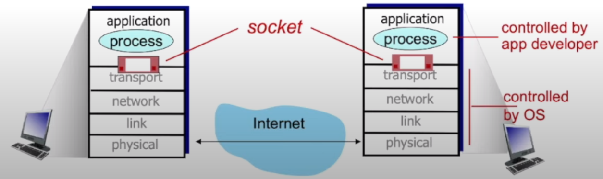
- process sends/receives messages to/from its **socket**
- socket analogous to door
  - sending process shoves messages out door
  - sending process relies on transport infrastructure on other side of door to deliver message to socket at receiving process
  - two sockets involved: one on each side

#### Addressing processes
- to receive messages, process must have **identifier**
- host device has unique 32-bit IP address
- many processes can be running on same host
- **identifier** includes both **IP address** and **port numbers** associated with process on host.
- example port numbers:
  - HTTP server: 80
  - mail server: 25

### An application-layer protocol defines:
- **types of messages exchanged**
  - e.g., request, response
- **message syntax:**
  - what fields in messages & how fields are delineated
- **message semantics**
  - meaning of information in fields
- **rules** for when and how processes send & respond to messages

#### open protocols:
- defined in RFCs, everyone has access to protocol definition
- allows for interoperability
- e.g., HTTP, SMTP

#### proprietary protocols:
- e.g., Skype, Zoom

### What transport service does an app need?
#### data integrity
- some apps (e.g., file transfer, web transactions) require 100% reliable data transfer
- other apps (e.g., audio) can tolerate some loss

#### timing
- some apps (e.g., Internet telephony, interactive games) require low delay to be "effective"

#### throughput
- some apps (e.g., multimedia) require minimum amount of throughput to be "effective"
- other apps ("elastic apps") make use of whatever throughput they get

#### security
- encryption, data integrity

#### Transport service requirements: common apps

| application            | data loss     | throughput                              | time sensitive |
| ---------------------- | ------------- | --------------------------------------- | -------------- |
| file transfer/download | no loss       | elastic                                 | no             |
| e-mail                 | no loss       | elastic                                 | no             |
| Web documents          | no loss       | elastic                                 | no             |
| real-time audiio/video | loss-tolerant | audio: 5Kbps-1Mbps, video: 10Kbps-5Mbps | yes, 10's msec |
| streaming audio/video  | loss-tolerant | same as above                           | yes, few secs  |
| interactive games      | loss-tolerant | Kbps+                                   | yes, 10's msec |
| text messaging         | no loss       | elastic                                 | yes and no     |

### Internet transport protocols services
| TCP service                                                                 | UDP service                                                                                                                       |
| --------------------------------------------------------------------------- | --------------------------------------------------------------------------------------------------------------------------------- |
| **reliable transport** between sending and receiving process                | **unreliable data transfer** between sending and receiving process                                                                |
| **flow control"** sender won't overwhelm receiver                           | **does not provide:** reliability, flow control, congestion control, timing, throughput guarantee, security, or connection setup. |
| **congestion control:** throttle sender when network overloaded             |                                                                                                                                   |
| **connection-oriented:** setup required between client and server processes |                                                                                                                                   |
| **does not provide:** timing, minimum throughput guarantee, security        |                                                                                                                                   |

### Internet applications, and transport protocols
| application            | application layer protocol | transport protocol |
| ---------------------- | -------------------------- | ------------------ |
| file transfer/download | FTP                        | TCP                |
| e-mail                 | SMTP                       | TCP                |
| Web documents          | HTTP 1.1                   | TCP                |
| Internet telephony     | SIP, RTP, or proprietary   | TCP or UDP         |
| streaming audio/video  | HTTP, DASH                 | TCP                |
| interactive games      | WOW, FPS (proprietary)     | UDP or TCP         |

### Securing TCP
#### Vanilla TCP & UDP sockets:
- no encryption
- cleartext passwords sent into socket traverse Internet in cleartext (!)

#### Transport Layer Security (TLS)
- provides encrypted TCP connections
- data integrity
- end-point authentication

### Overview
- application: distributed interacting processes, exchanging messages
- client-server, P2P paradigms
- sockets, addressing
- transport layer-service - possible, available services
- security and sockets

## 2.2 The Web and HTTP (part 1)

First, a quick review...
- web page consists of **objects**, each of which can be stored on different Web servers
- object can be HTML file, JPEG image, Java applet, audio file, ...
- web page consists of **base HTML-file** which includes **several referenced objects, each** addressable by a **URL**, e.g.,

```
www.someschool.edu/someDept/pic.gif
-----------------|----------------
    host name       path name
```

### HTTP overview
**HTTP: hypertext transfer protocol**
- Web's application layer protocol
- client/server model:
  - **client:** browser that requests, receives (using HTTP protocol) and "displays" Web objects
  - **server:** Web server sends (using HTTP protocol) objects in response to requests

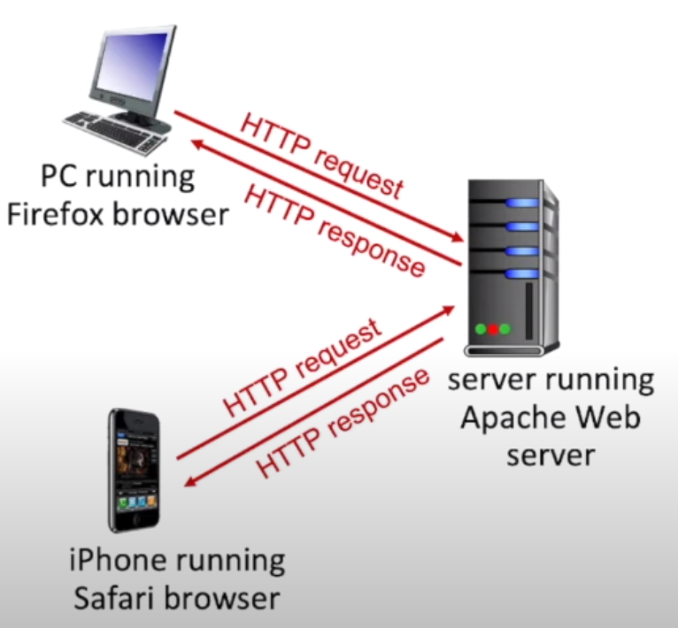

**HTTP uses TCP:**
- client initiates TCP connection (creates socket) to server, port 80
- server accepts TCP connection from client
- HTTP messages (application-layer protocol messages) exchanged between browser (HTTP client) and Web server (HTTP server)
- TCP connection closed

**HTTP is "stateless**
- server maintains no information about past client requests

**aside**

protocols that maintain "state" are complex!
- past history (state) must be maintained
- if server/client crashes, their views of "state" may be inconsistent, must be reconciled

### HTTP connections: two types
#### Non-persistent HTTP
1. TCP connection opened
2. at most one object sent over TCP connection
3. TCP connection closed

downloading multiple objects required multiple connections

#### Persistent HTTP
- TCP connection opened to a server
- multiple objects can be sent over single TCP connection between client, and that server
- TCP connection closed


### Non-persistent HTTP: example
User enters URL: `www.someSchool.edu/someDepartment/home.index` (containing text, references to 10 jpeg images)

| Client                                                                                                                                                            | Server                                                                                                                             |
| ----------------------------------------------------------------------------------------------------------------------------------------------------------------- | ---------------------------------------------------------------------------------------------------------------------------------- |
| 1a. HTTP client initiates TCP connection to HTTP server (process) at `www.someSchool.edu` on port 80                                                              |                                                                                                                                    |
|                                                                                                                                                                   | 1b. HTTP server at host `www.someSchool.edu` waiting for TCP connection at port 80 "accepts" connection, notifying client          |
| 2. HTTP client sends HTTP **request message** (containing URL) into TCP connection socket. Message indicates that client wants object `someDepartment/homw.index` |                                                                                                                                    |
|                                                                                                                                                                   | 3. HTTP server receives request message, forms **response message** containing requested object, and sends message into its socket |
|                                                                                                                                                                   | 4. HTTP server closes TCP connection.                                                                                              |
| 5. HTTP client receives response message containing html file, displays html. Parsing html file, finds 10 referenced jpeg objects                                 |                                                                                                                                    |
| 6. Steps 1-5 repeated for each of 10 jpeg objects                                                                                                                 |                                                                                                                                    |

#### Non-persistent HTTP: response time

**RTT (definition): time for a small packet to travel from client to server and back**

**HTTP response time (per object):**
- one RTT to initiate TCP connection
- one RTT for HTTP request and first few bytes of HTTP response to return
- object/file transmission time

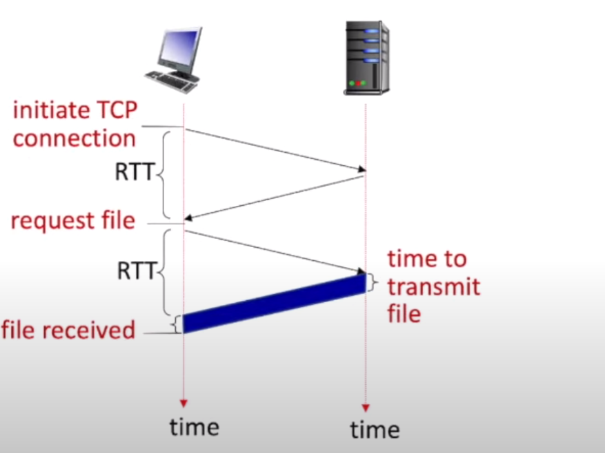

Non-persistent HTTP response time = 2RTT + file transmission time.

### Persistent HTTP (HTTP 1.1)
#### Non-persistent HTTP issues:
- require 2 RTTs per object
- OS overhead for each TCP connection
- browsers often open multiple parallel TCP connections to fetch referenced objects in parallel

#### Persistent HTTP (HTTP1.1):
- server leaves connection open after sending response
- subsequent HTTP messages between same client/server sent over open connection
- client sends requests as soon as it encounters a referenced object
- as little as one RTT for all the referenced objects (curring response time in half)

### HTTP request message
- two types of HTTP messages: **request, response**
- **HTTP request message:**
  - ASCII (human-readable format)


#### HTTP request message: general format
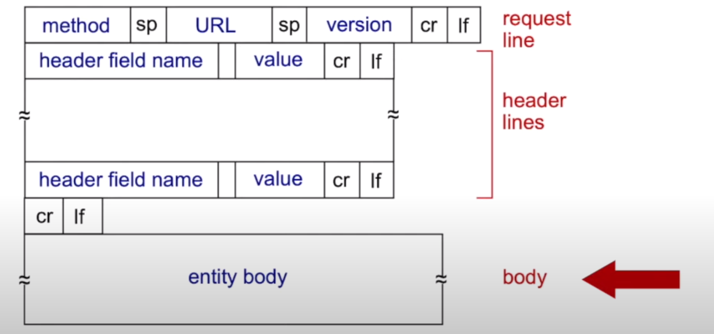

### HTTP request methods

#### POST methods:
- we page often includes form input
- user input sent from client to server in en entity body of HTTP POST request message

#### GET method
- include user data in URL field of HTTP GET request message (following a '?'):
- `www.somesite.com/animalsearch?monkeys&banana`

#### HEAD method:
- requests headers (only) that would be returned if specified URL were requested with and HTTP GET method

#### PUT method:
- uploads new file (object) to server
- completely replaces file that exists at specified URL with content in entity body of POST HTTP request message

### HTTP response message
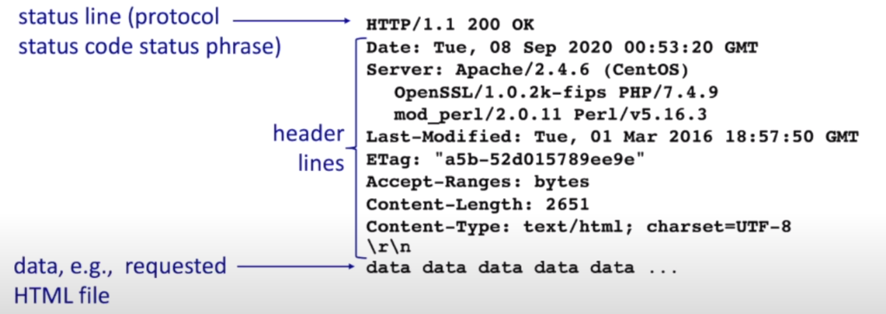

#### HTTP response status codes
- status code appears in 1st line in server-to-client response message.
- some sample codes:
  - 200 OK
    - request succeeded, requested object later in this message
  - 301 Moved Permanently
    - requested object moved, new location specified later in this message (in Location: field)
  - 400 Bad Request
    - request msg not understood by server
  - 404 Not Found
    - requested document not found on this server
  - 505 HTTP Version Not Supported

### Maintaining user/server state: cookies

Web sites and client browser use **cookies** to maintain some state between transactions

**four components:**
1. cookie header line of HTTP response message
2. cookie header line in next HTTP request message
3. cookie file kept on user's host, managed by user's browser
4. back-end database at Web site

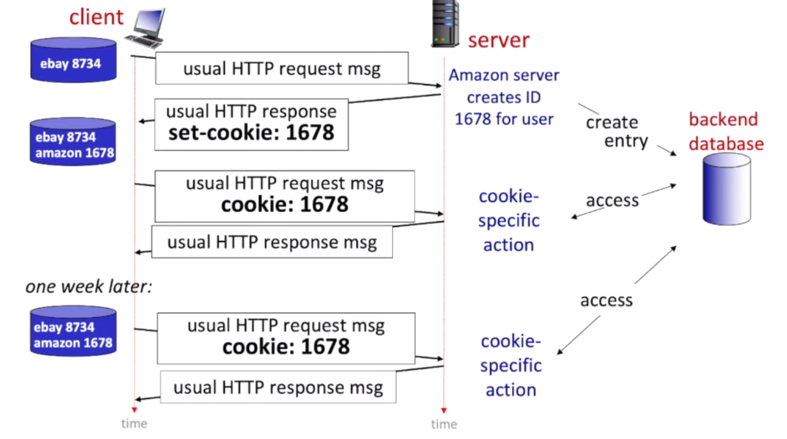

#### HTTP cookies: comments

**What cookies can be user for:**
- authorization
- shopping carts
- recommendations
- user session state (Web e-mail)

**Challenge: How to keep state?**
- **at protocol endpoints:** maintain state at sender/receiver over multiple transactions
- **in messages:** cookies in HTTP messages carry state

#### aside
**cookies and privacy:**
- cookies permit sites to learn a lot about you on their site.
- third party persistent cookies (tracking cookies) allow common identity (cookie value) to be tracked across multiple web sites

### Overview
- Web, HTTP overview
- HTTP connections
  - TCP, "stateless"
  - persistent, non-persistent
- HTTP messages
  - requests, responses
- HTTP cookies


## 2.2. The Web and HTTP part 2
### Web caches
**Goal:** satisfy client requests without involving origin server
- user configures browser to point to a (local) **Web cache**
- browser sends all HTTP requests to cache
  - if object in cache: cache returns object to client
  - else cache requests object from origin server, caches received object, then returns object co client

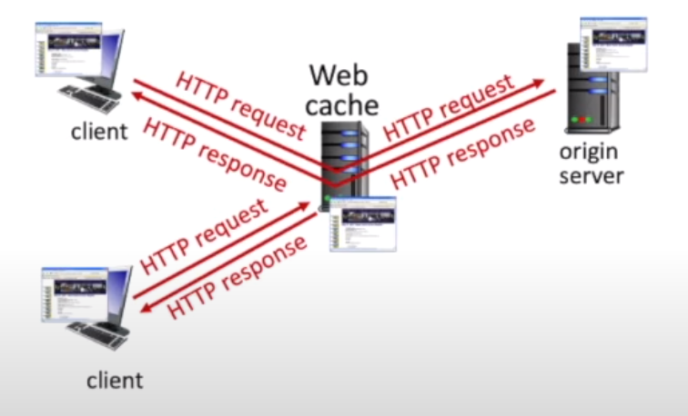

### Web caches (aka proxy servers)
- Web caches acts as both cllient and server
  - server for original requesting client
  - client to origin server
- server tells cache about object's allowable caching in response header:
  - `Cache-Control: max-age=<seconds>`
  - `Cache-Control: no-cache`

**Why** Web caching?
- reduce response time for client request
  - cache is closer to client
- reduce traffic on an institution's access link
- Internet is dense with caches
  - enables "poor" content providers to more effectively deliver content

### Caching example
**Scenario:**
- access link rate: 1.54 Mbps
- RTT from institutional router to server: 2 sec
- web object size: 100K bits
- average request rate from browsers to origin servers: 15/sec
  - avg data rate to browsers: 1.50 Mbps

**Performance:**
- access link utilization = .97
  - problem: large queueing delays at high utilization!
- LAN utilization: .0015
- end-end delay = Internet delay + access link delay + LAN delay = 2 sec + minutes + usecs

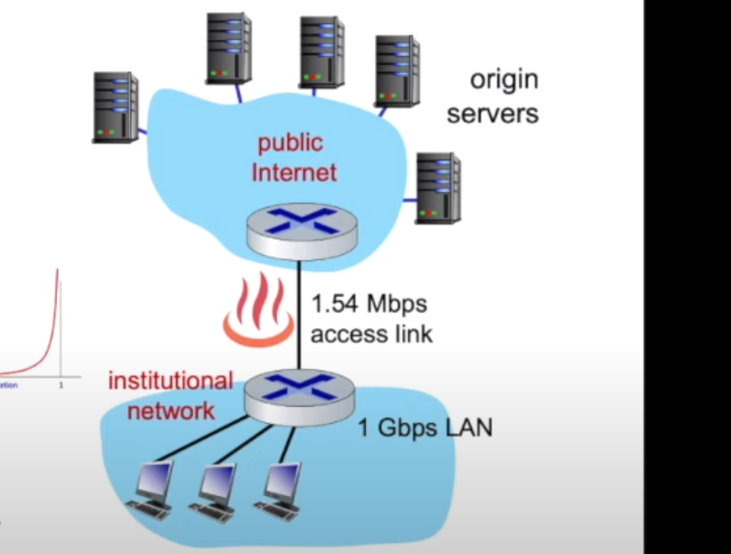

#### Option 1: buy a faster access link

Access link rate 1.54 Mbps -> 154Mbps

#### Option 2: install a web cache

**Calculating access link utilization, end-end delay with cache:**

suppose cache hit rate is 0.4:
- 40% requests served by cache, with low (msec) delay
- 60% requests satisfied at origin
  - rate to browsers over access link = 0.6 * 1.5 Mbps = .9 Mbps
  - access link utilization = 0.9/1.54 = .58 means low (msec) queueing delay at access link
- average end-end delay = 0.6 * (delay from origin servers) + 0.4 * (delay when satisfied at cache) = 0.6 (2.01) + 0.4(~msecs) = ~1.2 secs

**lower average end-end delay than with 154 Mbps link (and cheaper too!)**
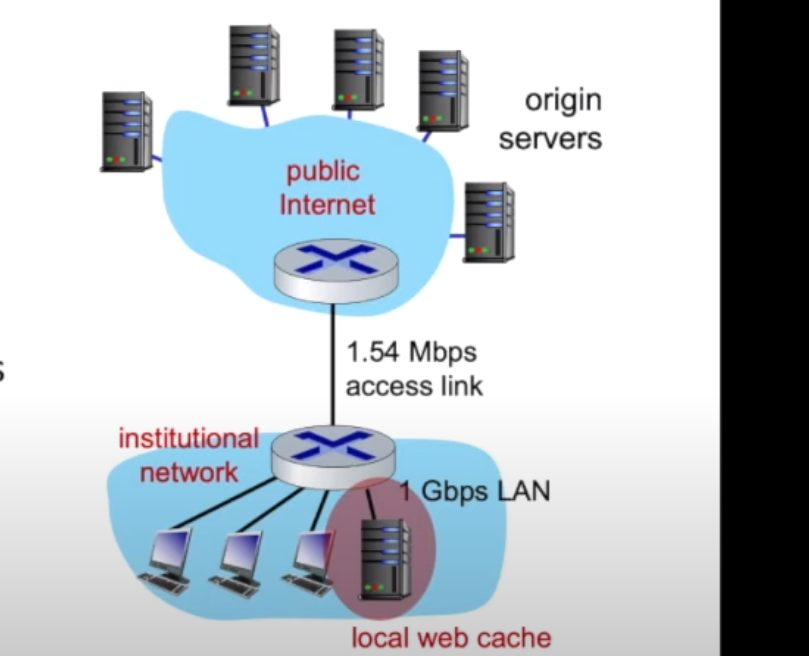

### Conditional GET
**Goal:** don't send objects if cache has up-to-date cached version
- no object transmission delay (or use of network resources)
- **client:** specify date of cached copy in HTTP request
  - `if-modified-since: <date>`
- **server:** response contains no object if cached copy is up-to-date:
  - `HTTP/1.0 304 Not Modified`

### HTTP/2
**Key goal:** decreased delay in multi-object HTTP requests

**HTTP/2:** increased flexibility at *server* in sending objects to client:
- methods, status codes, most header fields unchanged from HTTP 1.1
- transmission order of requested objects based on client-specified object priority (not necessarily FCFS)
- *push* unrequested objects to client
- divide objects into frames, schedule frames to mitigate HOL blocking

#### HTTP/2: mitigating HOL (Head Of the Line) blocking

HTTP/2: objects divided into frames, frame transmission interleaved.

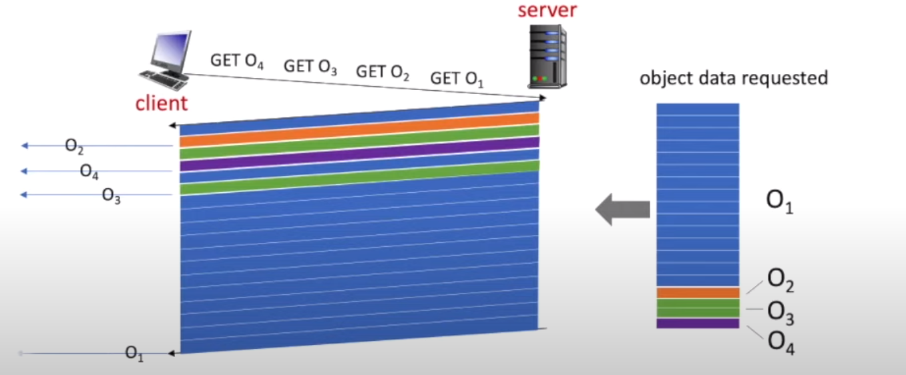

O2, O3, O4 delivered quickly, O1 slightly delayed

### HTTP/2 to HTTP/3
HTTP/2 over single TCP connection means:
- recovery from packet loss still stalls all object transmissions
  - as in HTTP 1.1, browsers have incentive to open multiple parallel TCP connections to reduce stalling, increase overall throughput
- no security over vanilla TCP connection
- **HTTP/3:** adds security, per object error- and congestion-control (more pipelining) over UDP
  - more on HTTP/3 in transport layer

### Overview
- Web caches
- Conditional HTTP GET
- HTTP/2, HTTP/3

## 2.3 E-mail, SMTP, IMAP
### E-mail
**Three major components:**
- user agents
- mail servers
- simple mail transfer protocol: SMTP

#### User Agent
- aka "mail reader"
- composing, editing, reading mail messages
- e.g., Outlook, Iphone mail client
- outgoing, incoming messages stored on server

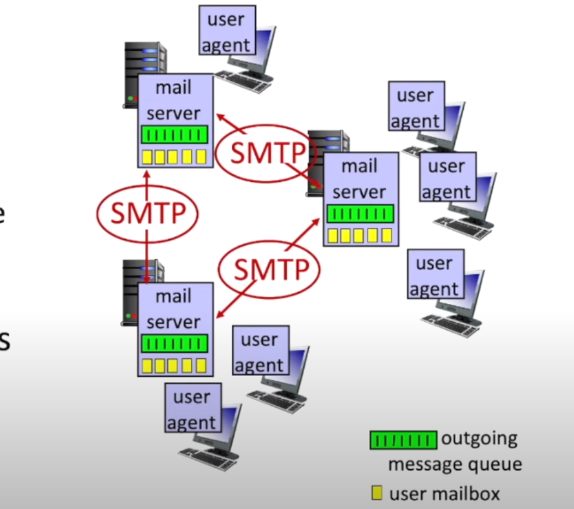

#### mail servers:
- **mailbox** contains incoming messages for user
- **message queue** of outgoing (to be sent) mail messages

#### SMTP protocol
- between mail servers to send email messages
- **client:** sending mail server
- **"server":** receiving mail server

### Scenario: Alice sends e-mail to Bob
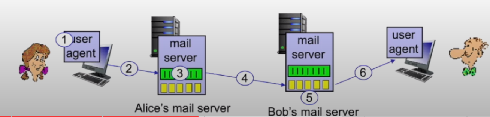

1. Alice uses UA to compose e-mail message "to" bob@someschool.edu
2. Alice's UA sends message to her mail server using SMTP; message placed in message queue
3. client side of SMTP at mail server opens TCP connection with Bob's mail server
4. SMTP client sends Alice's message over the TCP connection
5. Bob's mail server places the message in Bob's mailbox
6. Bob invokes his user agent to read message

### SMTP RFC (5421)
- uses TCP to reliably transfer email message from client (mail server initiating connection) to server, port 25
  - direct transfer: sending server (acting like client) to receiving server
- three phases of transfer
  - SMTP handshaking (greeting)
  - SMTP transfer of messages
  - SMTP closure
- command/response interaction (like HTTP)
  - **commands:** ASCII text
  - **response:** status code and phrase

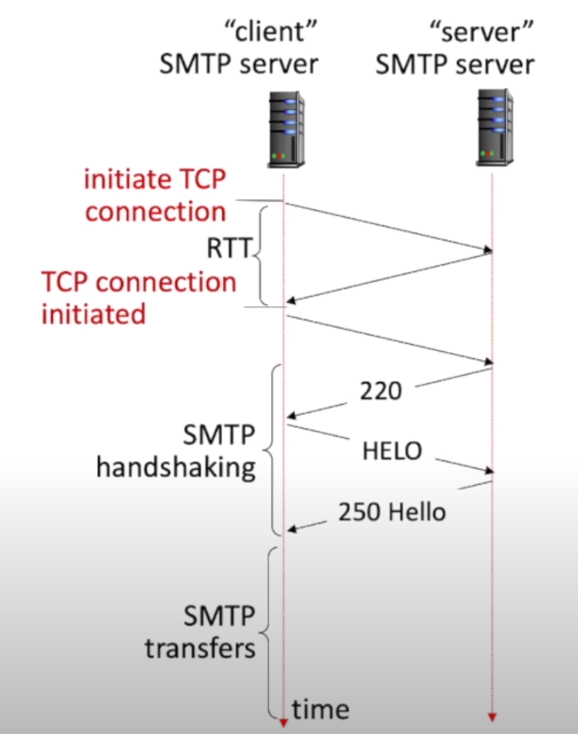

#### Sample SMTP interaction
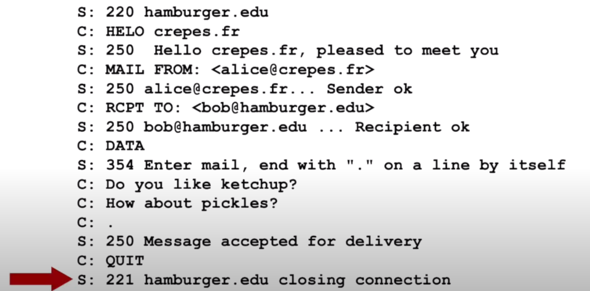

#### SMTP: observations
**comparison with HTTP:**

- HTTP: client pull
- SMTP: client push
- both have ASCII command/response interaction, status codes
- HTTP: each object encapsulated in its own response message
- SMTP: multiple objects sent in multipart message
- SMTP uses persistent connections
- SMTP requires message (header & body) to be in 7-bit ASCII
- SMTP server uses CRLF.CRLF to determine end of message

#### Mail message format
SMTP: protocol for exchangin e-mail messages, defined in RFC 5321 (like RFC 7231 defined HTTP).

RFC 2822 defined *syntax* for e-mail message itself (like HTML defines syntax for web documents).

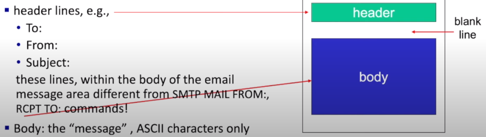

### Retrieving email: mail access protocols
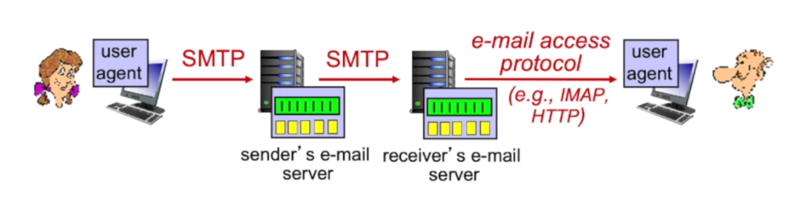

- **SMTP:** delivery/storage of e-mail messages to receiver's server
- mail access protocol: retrieval from server
  - **IMAP:** Internet Mail Access Protocol [RFC 3501]: messages stored on server, IMAP provides retrieval, deletion, folders of stored messages on server
- **HTTP:** gmail, Hotmail, Yahoo!Mail, etc. provides web-based interface on top of SMTP (to send), IMAP (or POP) to retrieve e-mail messages

### Overview
E-mail

- infrastructure: user agents, servers, mailboxes
- SMTP: simple mail transfer protocol

## 2.4 The Domain Name System (DNS)

**people:** many identifiers:
- SSN, name, passport #

**Internet hosts, routers:**
- IP address - used for addressing datagrams
- "name", e.g., `cs.umass.edu` - used by humans

**Q:** how to map between IP address and name, and vice versa?

**Domain Name System (DNS):**
- **distributed database** implemented in hierarchy of many **name servers**
- **application-layer protocol:** hosts, DNS servers communicate to **resolve** names (address/name translation)
  - note: core Internet function, **implemented as application-layer protocol**
  - complexity at network's "edge"

### DNS: services, structure
#### DNS services:
- hostname-to-IP-address translation
- host aliasing
  - canonical, alias names
- mail server aliasing
- load distribution
  - replicated Web servers: many IP addresses correspond to one name

#### Centralized/Distributed DNS
**Q: Why not centralize DNS?**
- single point of failure
- traffic volume
- distant centralized database
- maintenance

**A: doesn't scale!**
- Comcast DNS servers alone: 600B DNS queries/day
- Akamai DNS servers alone: 2.2T DNS queries/day

### Thinking about the DNS
**humongous distributed database:**
- ~ billion records, each simple

**handles many trillions of queries/day:**
- many more reads than writes
- performance matters: almost every Internet transaction interacts with DNS - msecs count!

**organizationally, physically decentralized:**
- millions of different organizations responsible for their records

**"bulletproof": reliability, security**

### DNS: a distributed, hierarchical database
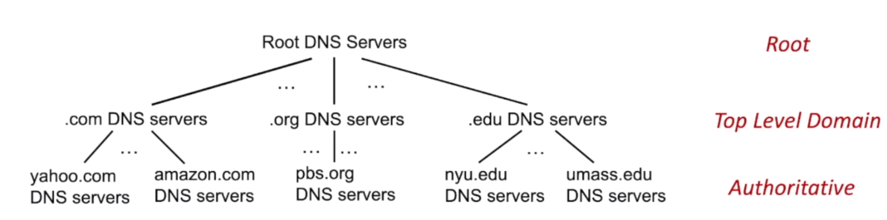

Clients wants IP address for `ww.amazon.com`; 1st approximation:
- client queries, root server to find `.com` DNS server
- client queries `.com` DNS server to get `amazon.com` DNS server
- client queries `amazon.com` DNS server to get IP address for `www.amazon.com`

### DNS: root name servers
- official, contact-of-last-resort by name servers that can not resolve name
- **incredibly important** Internet function
  - Internet couldn't function without it!
  - DNSSEC - provides security (authentication, message integrity)
- ICANN (Internet Corporation for Assigned Names and Numbers) manages root DNS domain

13 logical root name "servers" worldwide each "server" replicated many times (~200 servers in US)

### Top-Level Domain, and authoritative servers

#### Top-Level Domain (TLD) servers:
- responsible for `.com`, `.org`, `.net`, `.edu`, `.aero`, `.jobs`, and all top-level country domains, e.g.: `.cn`, `.uk`, `.fr`
- Network Solutions: authoritative registry for `.com`, `.net` TLD
- Educause: `.edu` TLD

#### authoritative DNS servers:
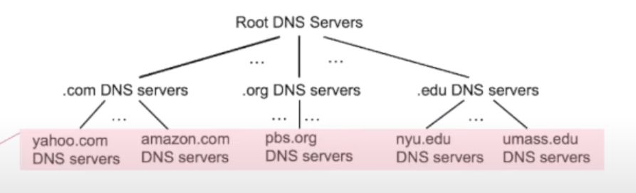

- organization's own DNS server(s), providing authoritative hostname to IP mappings for organization's named hosts
- can be maintained by organization or service provider

### Local DNS name servers
- when host makes DNS query, it is sent to its *local* DNS server
  - Local DNS server returns reply, answering:
    - from its local cache of recent name-to-address translation pairs (possibly out of date!)
    - forwarding request into DNS hierarchy for resolution
  - each ISP has local DNS name server; to find yours:
    - MacOS: `% scutil --dns`
    - Windows: `>ipcondig /all`

### DNS name resolution

#### Iterated query

**Example:** host at `engineering.nyu.edu` wants IP address for `gaia.cs.umass.edu`

**Iterated query:**
- contacted server replies with name of server to contact
- "I don't know this name, but ask this server"

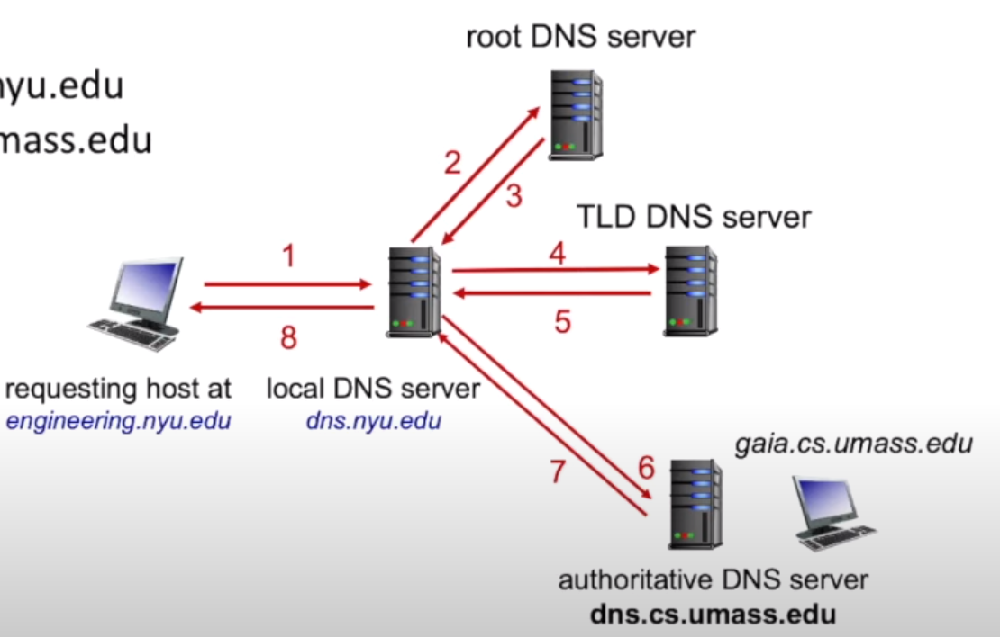

#### Recursive query

**Recursive query:**
- puts burden of name resolution on contacted name server
- heavy load at upper levels of hierarchy

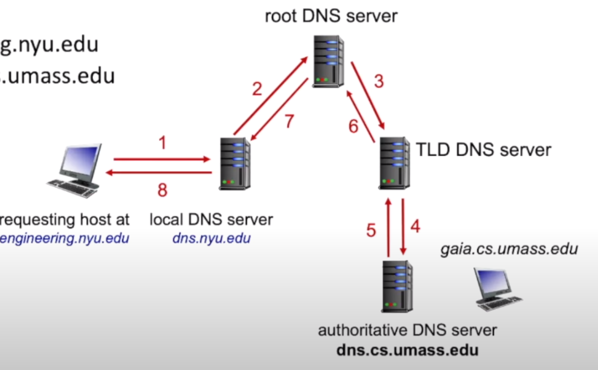

Not often used in practice.

### Caching DNS Information
- once (any) name server learns mapping, it **caches** mapping, and **immediately** returns a cached mapping in response to a query
  - caching improves response time
  - cache entries timeout (disappear) after some time (TTL)
  - TLD servers typically cached in local name servers
- cached entries may be **out-of-date**
  - if named host changes IP address, may not be known Internet-wide until all TTLs expire!
  - best-effort name-to-address translation!

### DNS records

**DNS:** distributed database storing resource records **(RR)**.

#### RR format: (name, value, type, ttl)

#### type=A
- `name` is hostname
- `value` is IP address

#### type=NS
- `name` is domain (e.g., `foo.com`)
- `value` is hostname of auhtoritative name server for this domain

#### type=CNAME
- `name` is alias name for some "canonical" (the real) name
- `www.ibm.com` is really `servereast.backup2.ibm.com`
- `value` is canonical name

#### type=MX
- `value` is name of SMTP mail server associated with `name`

### DNS protocol messages
DNS **query** and **reply** messages, both have same **format:**

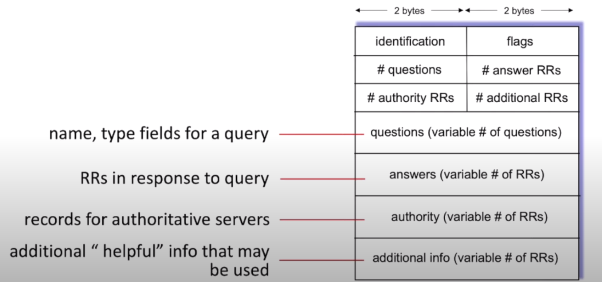

### Getting your info into the DNS

example: new startup "Network Utopia"

- register name `networkutopia.com` at **DNS registrar** (e.g., Network Solutions)
  - provide names, IP addresses of authoritative name server (primary and secondary)
  - registrar inserts NS, A RRs into `.com` TLD server:
    - `(networkutopia.com, dns1.networkutopia.com, NS)`
    - `(dns1.networkutopia.zom, 212.212.212.1, A)`
- create authoritative server locally with IP address `212.212.212.1`
  - type A record for `www.networkutopia.com`
  - type MX record for `networkutopia.com`


### DNS security
#### DDoS attacks
- bombard root servers with traffic
  - not successful to date
  - traffic filtering
  - local DNS servers cache IPs of TLD servers, allowing root server bypass
- bombard TLD servers
  - potentially more dangerous

#### Spoofing attacks
- intercept DNS queries, returning bogus replies
  - DNS cache poisoning
  - RFC 4033: DNSSEC authentication services

### Overview
- DNS structure, function
- resolving DNS queries
- DNS record format
- DNS protocol messages

## 2.5 P2P applications
- no always-on server
- arbitrary end systems directly communicate
- peers request service from other peers, provide service in return to other peers
  - self scalability - new peers bring new service capacity, and new service demands
- peers are intermittently connected and change IP addresses
  - complex management
- examples: P2P file sharing (BitTorrent), streaming (KanKan), VolP (Skype)

### File distribution time: client-server
- **server transmission:** must sequentially send (upload) N file copies:
  - time to send one copy: F/u_s
  - time to send N copies: NF/u_s
- **client:** each client must download file copy
  - d_min = min client download rate
  - min client download time: F/d_min

Time to distribute F to N clients using client-server approach:

D_{c-s} >= max{NF/u_s, F/d_min}

increases linearly in N.
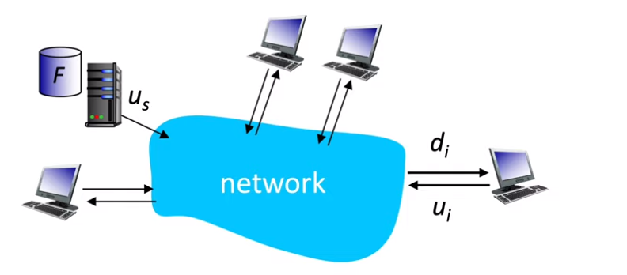

### File distribution time: P2P
- **server transmission:** must upload ata least one copy:
  - time to send one copy: F/u_s
- **client:** each client must download file copy
  - min client download time: F/d_min
- **clients:** as aggregate must download NF bits
  - max upload rate (limiting max download rate) is u_s + sum u_i

time to distribute F to N clients using P2P approach:

D_{p2p} >= max{F/u_s, F/d_min, NF/(u_s + sum u_i)}

#### Client-server vs P2P: example
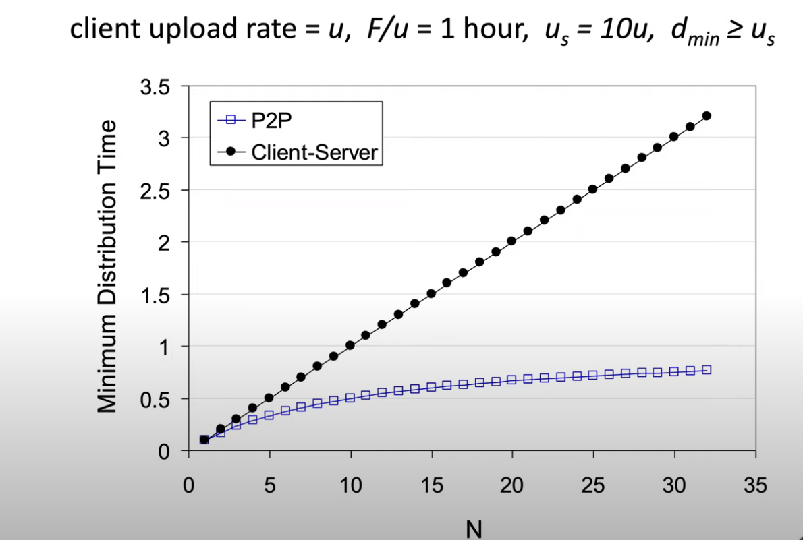

### P2P file distribution: BitTorrent
- file divided into 256Kb chunks
- peers in torrent send/receive file chunks

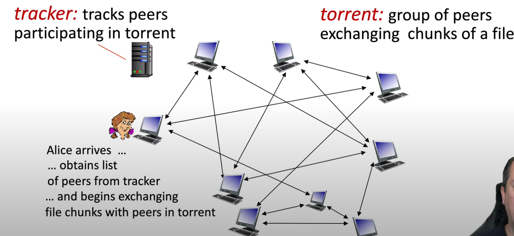

- peer joining torrent:
  - has no chunks, but will accumulate them over time from other peers
  - registers with tracker to get list of peers, connects to subset of peers ("neighbors")
- while downloading, peer uploads chunks to other peers
- peer may change peers with whom it exchanges chunks
- **churn:** peers may come and go
- once peer has entire file, it may (selfishly) leave or (altruistically)  stay in torrent

#### BitTorrent: requesting, sending file chunks
**Requesting chunks:**
- at any given time, different peers have different subsets of file chunks
- periodically, Alice asks each peer for list of chunks that they have
- Alice requests missing chunks from peers, rarest first

**Sending chunks: tit-for-tat**
- Alice sends chunks to those four peers currently sending her chunks at highest rate
- other peers are choked by Alice (do not receive chunks from her)
- re-evaluate top 4 every10 secs
- every 30 secs: randomly select another peer, starts sending chunks
  - "optimistically unchoke" this peer
  - newly chosen peer may join

#### BitTorrent: tit-for-tat
1. Alice "optimistically unchokes" Bob
2. Alice becomes one of Bob's top-four providers; Bob reciprocates
3. Bob becomes one of Alice's top-four providers

higher upload rate: find better partners, get file faster!

## 2.6 Video streaming, CDNs

### Video Streaming and CDNs: context
- stream video traffic: major consumer of Internet bandwidth
  - Netflix, YouTube, Amazon Prime: 80% of residential ISP traffic (2020)
- **challenge:** scale - how to reach ~1B users?
- **challenge:** heterogeneity
  - different users have different capabilities (e.g., wired versus mobile; bandwidth rich versus bandwidth poor)
- **solution:** distributed, application-level infrastructure

### Multimedia: video
- video: sequence of images displayed at constant rate
  - e.g., 24 images/sec
- digital image: array of pixels
  - each pixel represented by bits
- coding: use redundancy **within** and **between** images to decrease # bits used to encode image
  - spatial (within image)
  - temporal (from one image to next)

Different codings:
- **CBR: (constant bit rate):** video encoding rate fixed
- **VBR: (variable bit rate):** video encoding rate changes as amount of spatial, temporal coding changes
- **examples:**
  - MPEG1 (CD-ROM) 1.5 Mbps
  - MPEG2 (DVD) 2-6 Mbps
  - MPEG4 (often used in Internet, 64 Kbps - 12 Mbps)

### Streaming stored video
Main challenges:
- server-to-client bandwidth will **vary** over time, with changing network congestion levels (in house, access network, network core, video server)
- packet loss, delay due to congestion will delay playout, or result in poor video quality

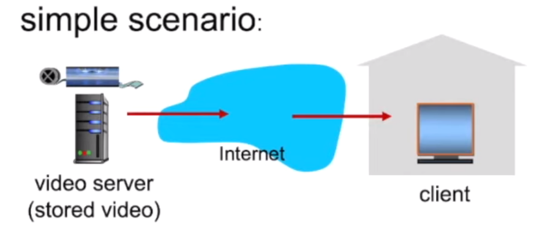

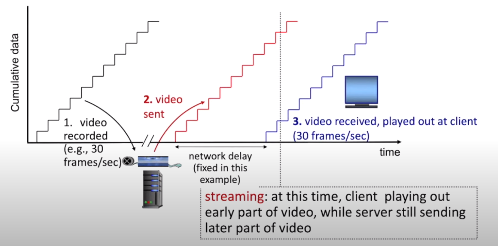

### Streaming stored video: challenges
- **continuous playout constraint:** during client video playout, playout timing must match original timing
  - but **network delays are variable** (jitter), so will need **client-side buffer** to match continuous playout constraint
- other challenges:
  - client interactivity: pause, fast-forward, rewind, jump through video
  - video packets may be lost, retransmitted

### Streaming stored video: playout buffering
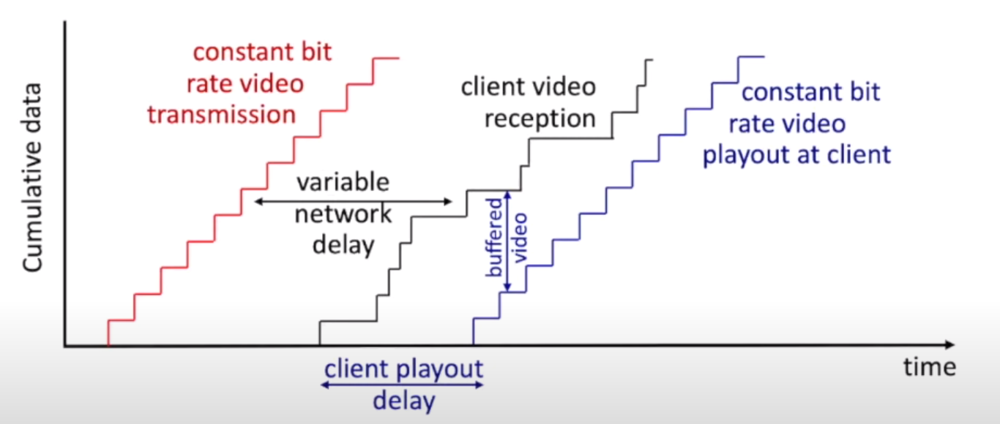
- **client-side buffering and playout delay:** compensate for network-added delay, delay jitter

### Streaming multimedia: DASH
Dynamic, Adaptive Streaming over HTTP.

**server:**
- divides video file into multiple chunks
- each chunk encoded at multiple different rates
- different rate encodings stored in different files
- files replicated in various CDN nodes
- **manifest file:** provides URLs for different chunks

**client:**
- periodically estimates server-to-client bandwidth
- consulting manifest, requests one chunk at a time
  - chooses maximum coding rate sustainable given current bandwidth
  - can choose different coding rates at different points in time (depending on available bandwidth at time), and from different servers

#### "intelligence" at client:
client determines:
- **when** to request chunk (so that buffer starvation, or overflow does not occur)
- **what encoding rate** to request (higher quality when more bandwidth available)
- **where** to request chunk (can request from URL server that is "close" to client or has high available bandwidth)

### Content distribution networks (CDNs)
**challenge:** how to stream content (selected from millions of videos) to hundreds of thousands of simultaneous users?

- **option 1:** single, large "mega-server"
  - single point of failure
  - point of network congestion
  - long (and possibly congested) path to distant clients

...quite simply: this solution **doesn't scale**

- **option 2:** store/serve multiple copies of videos at multiple geographically distributed sites **(CDN)**
  - **enter deep:** push CDN servers deep into many access networks
    - close to users
    - Akamai: 240,000 servers deployed in >120 countries (2015)
  - **bring home:** smaller number (10's) of larger clusters in POPs near access nets
    - used by Limelight

### Content distribution networks (CDNs)
- CDN: stores copies of content (e.g. MADMEN) at CDN nodes
- subscriber requests content, service provider returns manifest
  - using manifest, client retrieves content at highest supportable rate
  - may choose different rate or copy if network path congested

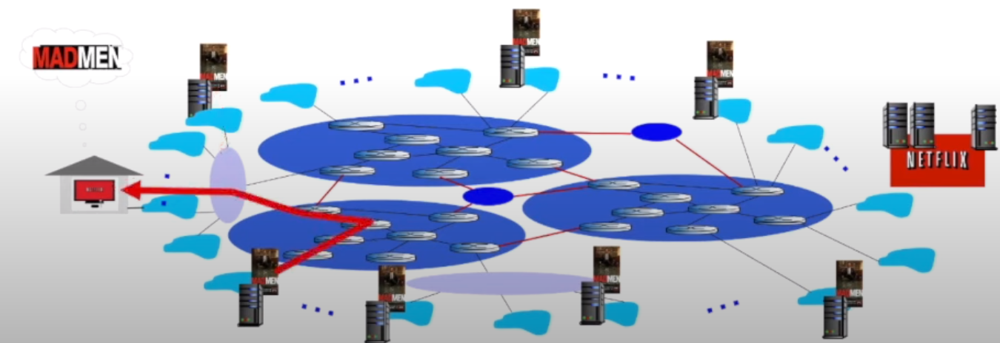

Netflix is an example of **OTT: "over the top"** service.

Internet host-host communication as a service.

### Overview
- video characteristics
- streaming stored video
  - buffering
  - playout
- DASH: dynamic client-driven streaming
- CDNs, example

## 2.7 Socket programming
**goal:** learn how to build client/server applications that communicate using sockets.

**socket:** the only door between application process and end-end-transport protocol.

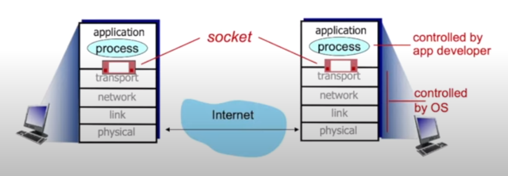

### Two socket types for two transport services:
- **UDP:** unreliable datagram
- **TCP:** reliable, byte stream-oriented

**Application Example:**
1. client reads a line of characters (data) from its keyboard and sends data to server
2. server receives the data and converts characters to uppercase
3. server sends modified data to client
4. client receives modified data and displays line on its screen

### Socket programming with UDP
**UDP:** no "connection" between client and server:
- no handshaking before sending data
- sender explicitly attaches IP destination address and port # to each packet
- receiver extracts sender IP address and port $ from received packet

**UDP:** transmitted data may be lost or recieved out-of-order

**Application viewpoint:**
- UDP provides unreliable transfer of groups of bytes ("datagrams") between client and server processes

#### Client/server socket interaction: UDP
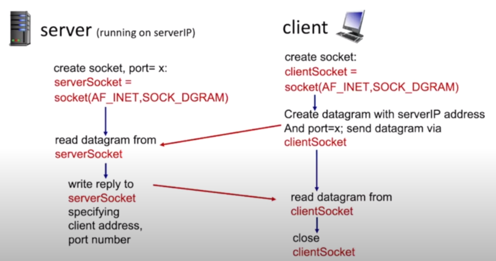

#### Example app: UDP client
**Python UDPClient**

```
from socket import *
serverName = 'hostname'
serverPort = 12000
clientSocket = socket(AF_INET, SOCK_DGRAM)
message = raw_input('Input lowercase sentence:')
clientSocket.sendto(message.encode(), (serverName, serverPort))
modified Message, serverAddress = clientSocket.recvfrom(2048)
print modifiedMessage.decode()
clientSocket.close()
```

### Example app: UDP server
**Python UDPServer**

```
from socket import *
serverPort = 12000
serverSocket = socket(AF_INET, SOCK_DGRAM)
serverSocket.bind((``, serverPort))
print ("The server is ready to receive")
while True:
    message, clientAddress = serverSocket.recvfrom(2048)
    modifiedMessage = message.decode().upper()
    serverSocket.sendto(modifiedMessage.encode(), clientAddress)
```

### Socket programming with TCP
**Client must contact server**
- server process must first be running
- server must have created socket (door) that welcomes client's contact

**Client contact server by:**
- Creating TCP socket, specifying IP address, port number of server process
- **when client creates socket:** client TCP establishes connection to server TCP

**Important:**
- when contacted by client, **server TCP creates new socket** for server process to communicate with that particular client
  - allows server to talk with multiple clients
  - source port numbers used to distinguish clients (more in Chap 3)

**Application viewpoint:**

TCP provides reliable, in-order byte-stream transfer ("pipe") between client and server processes.

### Client/server socket interaction: TCP
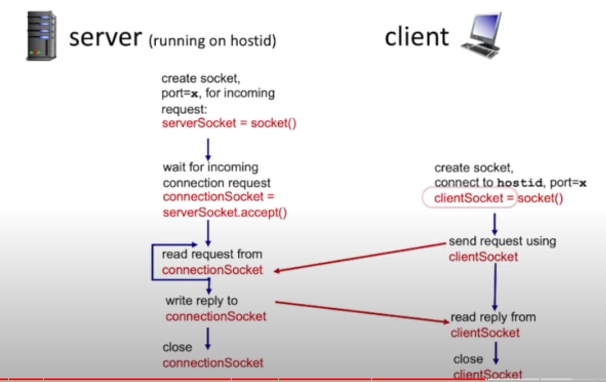

#### Example app: TCP client
**Python TCPClient**

```
from socket import *
serverName = 'servername'
serverPort = 12000
clientSocket = socket(AF_INET, SOCK_STREAM)
clientSocket.connect((serverName, serverPort))
sentence = raw_input('Input lowercase sentence:')
clientSocket.send(sentence.encode())
modifiedSentence = clientSocket.recv(1024)
print('From Server:', modifiedSentence.decode())
clientSocket.close()
```

#### Example app: TCP server
**Python TCPServer**

```
from socket import *
serverPort = 12000
serverSocket = socket(AF_INET, SOCK_STREAM)
serverSocket.bind(('', serverPort))
serverSocket.listen(1)
print 'The server is ready to receive'
while True:
    connectionSocket, addr = serverSocket.accept()

    sentence = connectionSocket.recv(1024).decode()
    capitalizedSentence = sentence.upper()
    connectionSocket.send(capitalizedSentence.encode())
    connectionSocket.close()
```

### Overview
- socket abstraction
- UDP socket
- TCP sockets

## Chapter 2: Summary
**our study of network application layer is now complete!**

- application architectures
  - client-server
  - P2P
- application service requirements:
  - reliability, bandwidth, delay
- Internet transport service model
  - connection-oriented, reliable: TCP
  - unreliable, datagrams: UDP
- specific protocols:
  - HTTP
  - SMTP, IMAP
  - DNS
  - P2P: BitTorrent
- video streaming, CDNs
- socket programming: TCP, UDP sockets

**Most importantly: learned about protocols!**
- typical request/reply message exchange:
  - client requests info or serviceserver responds with data, status code
- message formats:
  - **headers:** fields giving info about data
  - **data:** info(payload) being communicated

**important themes:**
- centralized bs. decentralized
- stateless vs. stateful
- scalability
- reliable vs. unreliable message transfer
- "complexity at network edge"
