# Network Algorithms
[Playlist of Jim Kurose course](https://youtube.com/playlist?list=PLOsilMR_Br3aXSpaWNSMSLU7YIIUFqHKj)

# Lecture 1
## 1.1 Introduction - What is the Internet?
### The Internet: a "nuts and bolts" view

#### Internet's edge
There are billions of connected computing devices:
- *hosts* = end systems
- running network *apps* at Internet's "edge"

#### Packet switches
They forward packets (chunks of data):
- routers, switches

#### Communication links:
- fiber, copper, radio, satellite
- transmission rate: bandwidth

#### Networks
- collection of devices, routers, links: managed by an organization

#### Internet is the *network of networks*

#### Protocols
are everywhere:
- control sending, receiving of messages
- e.g., HTTP, streaming video, Skype, TCP, IP, WiFi, 4G, Ethernet

#### Internet Standards
- RFC: Request for Comments
- IETF: Internet Engineering Task Force

### The Internet: a "services" view

#### Infrastructure
that provides services to applications:
- Web, streaming video, multimedia, teleconferencing, email, inter-connected appliances

#### Programming interface
- Provides "hooks" that allow (sending/receiving apps) to "connect" to, use Internet transport service
- Provides service options, analogous to postal service

### What's a protocol?
#### Human protocols:
- What's the time?
  - Do you have the time?
  - Yes, it's 9 p.m.
- Questions
  - Are there any questions?
  - Yes, *raises hand*
  - My question is ...
  - Thanks, the answer is ...

So a protocol is:
- rules for specific messages sent
- rules for specific actions taken, when message received, or other events

#### Internet protocols
Are analogous to human protocols, except:
- Replace humans with computers (devices)
- All communication activity in Internet is governed by protocols

#### Final definition
**Protocols** define the **format**, **order** of **messages sent and received** among network entities, and
**actions taken** on message transmission, receipt.

### Overview
- What is the Internet?
- What is a protocol?

## 1.2. The network edge
### Network edge:
- hosts: clients and servers
  - they are called "hosts" because they host or run network applications
- servers often in data centers

### Access networks and physical media
#### How to connect end systems to edge router?
3 types of access networks:
- residential access nets
- institutional access networks (school, company)
- mobile access network (WiFi, 4G/5G)

#### What to look for?
- transmission rate (bits per second) of access network?
- shared or dedicated access among users?

#### Examples of residential access nets

##### Cable-based access
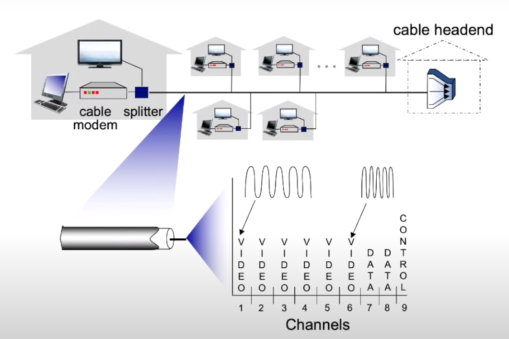

Frequency division multiplexing (FDM): different channels transmitted in different frequency bands.

###### HFC: hybrid fiber coax
- asymmetric: up to 40Mbps - 1.2 Gbps downstream transmission rate, 30-100 Mbps upstream transmission rate
  - downstream means TO HOME, upstream - FROM HOME
Homes *share access network* to cable headend.

##### Digital subscriber line (DSL)
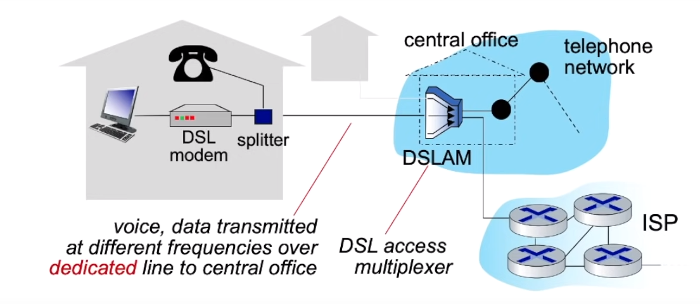
- use exising telephone line to central office DSLAM
- not shared between neighbors
- 24-52 Mbps downstream rate
- 3.5-16 Mbps upstream rate

##### How home networks look like?
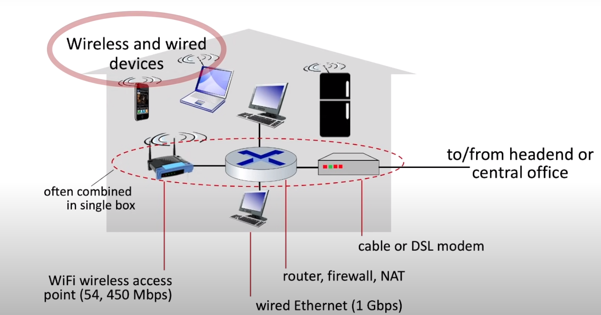

#### Wireless access networks
There are two classes:
- Wireless local are networks (WLANs)
- Wide-area cellular access networks

Both connect end system to router
- via base station aka "access point"

##### WLANs
- typically within or around building (~30m)
- Operate in different speeds: 11, 54, 450 Mbps transmission rate

##### Wide-area cellular access networks
- provided by mobile, cellular network operator (10's km)
- 10's Mbps
- 4G cellular networks (5G coming)

#### Enterprise networks
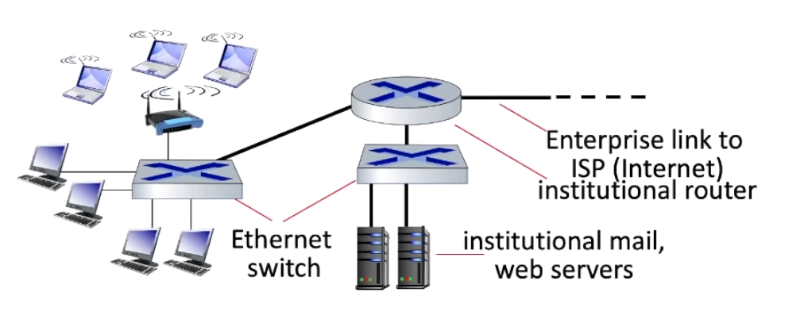

- companies, universities, etc
- mix of wired, wireless, connecting a mix of switches and routers

#### Data center networks
- high-bandwidth links (10s to 100s Gbps) connect hundreds to thousands of servers together, and to Internet

### Host: sends packets of data
host sending function:
- takes application message
- breaks into chunks, packets, of length *L* bits
- transmits packet into access network at *transmission rate R*
  - link transmission rate, aka link *capacity, aka link bandwidth*

packet transmission delay = time needed to transmit packet into link = *L / R*

### Links: physical media
- bit: propagates between transmitter / receiver pairs
- physical link: what lies between transmitter & receiver
- guided media:
  - signals propagate in solid media: copper, fiber, coax
- unguided media:
  - signals propagate freely, e.g., radio

#### Twisted pair (TP)
- 2 insulated copper wires
  - Category 5: 100 Mbps, 1 Gbps Ethernet
  - Category 6: 10 Gbps Ethernet

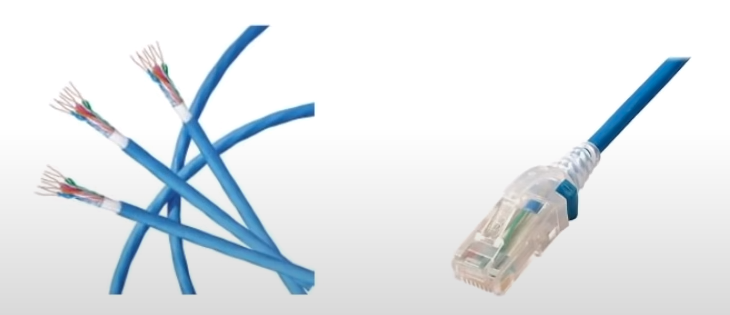

#### Coaxial cable
- two concentric copper conductors
- bidirectional
- broadband:
  - multiple frequency channels on cable
  - 100's Mbps per channel

#### Fiber optic cable:
- glass fiber carrying light pulses, each pulse a bit
- high-speed operation:
  - high-speed point-to-point transmission (10's - 100's Gbps)
- low error rate:
  - repeaters spaced far apart
  - immune to electromagnetic noise

#### Wireless radio
- signal carried in various "bands" in electromagnetic spectrum
- no physical wire
- broadcast, "half-duplex" (sender to receiver)
- prone to environment effects:
  - reflection
  - obstruction by objects
  - interference / noise

##### Radio link types
- Wireless LAN (WiFi)
  - 10-100's Mbps; 10's of meters
- wide-area (4G cellular)
  - 10's Mbps over ~10 Km
- Bluetooth: cable replacement
  - short distances, limited rates
- Terrestrial microwave
  - point-to-point; 45 Mbps channels
- Satellite
  - up to 45 Mbps per channel
  - 270 msec end-end delay

## 1.3 Network core: packet/circuit switching, internet structure

### The network core
- mesh of routers connected with links
- **packet-switching**: hosts break application-layer messages into packets
  - network *forwards* packets from one router to the next, across links on path from *source to destination*

### Two key network-core functions
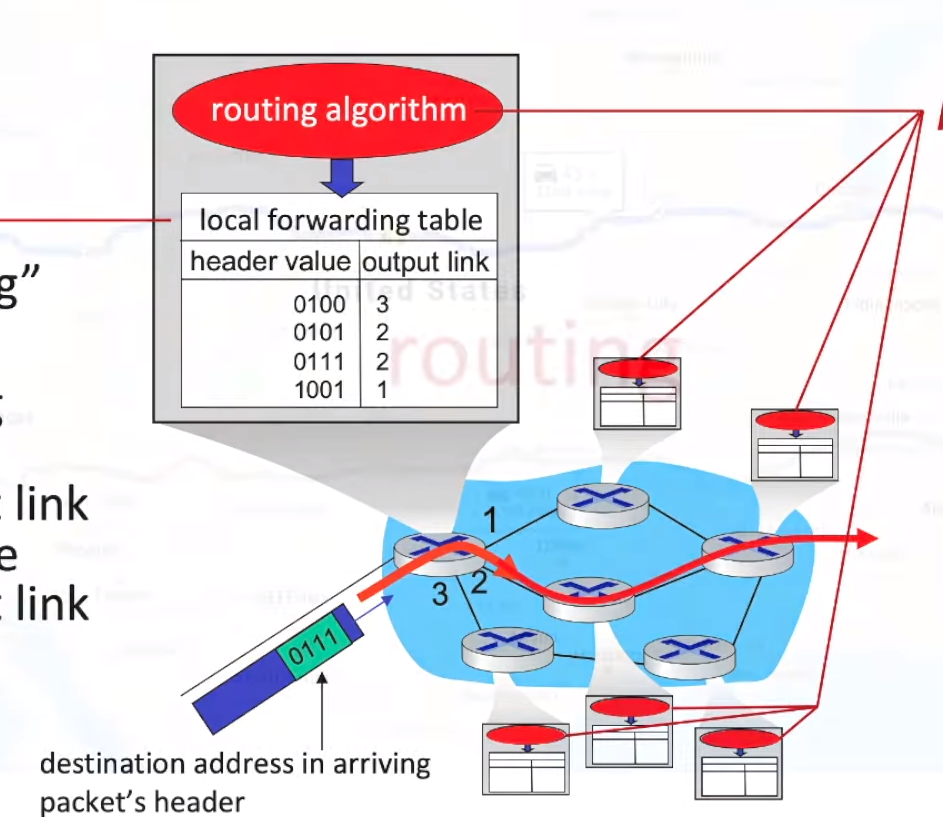

#### Forwarding
- aka "switching"
- **local** action: move arriving packets from router's input link to appropriate router output link

#### Routing
- **global** action: determine source-destination paths taken by packets
- routing algorithms

### Packet-switching: store-and-forward
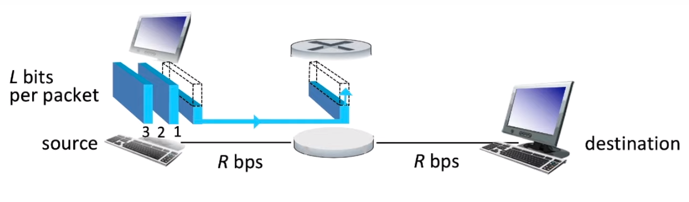

Entire packet must arrive at router before it can be transmitted on next link.

### Packet-switching: queueing
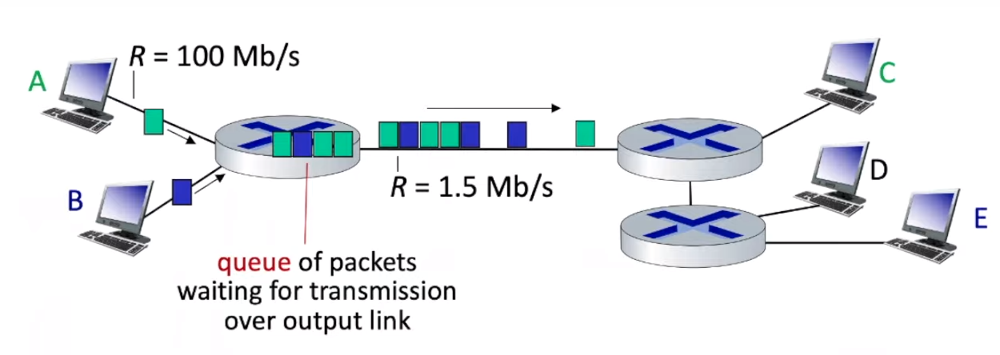

If arrival rate (in bps) to links exceeds transmission rate (bps) of link for some period of time:
- packets will queue, waiting to be transmitted on output link
- packets can be dropped (lost) if memory (buffer) in router fills up

### Alternative to packet switching: circuit switching
end-end resources allocated to, reserved for "call" between source and destination.
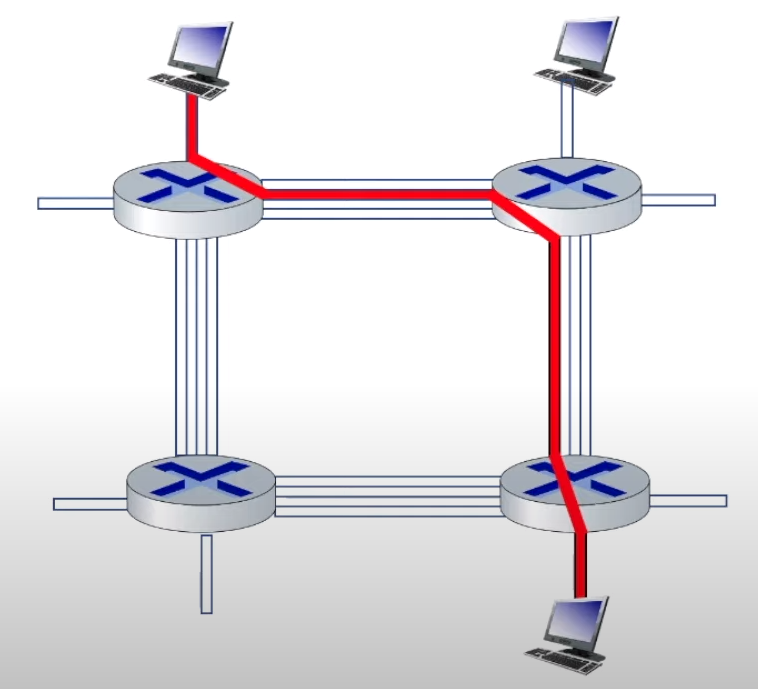

Link capacity is reserved exclusively for the call:
- no queueing
- no delay except for the propagation delay
- no loss of data

Cons:
- circuit segment idle if not used by call (no sharing)

#### Circuit switching: FDM and TDM
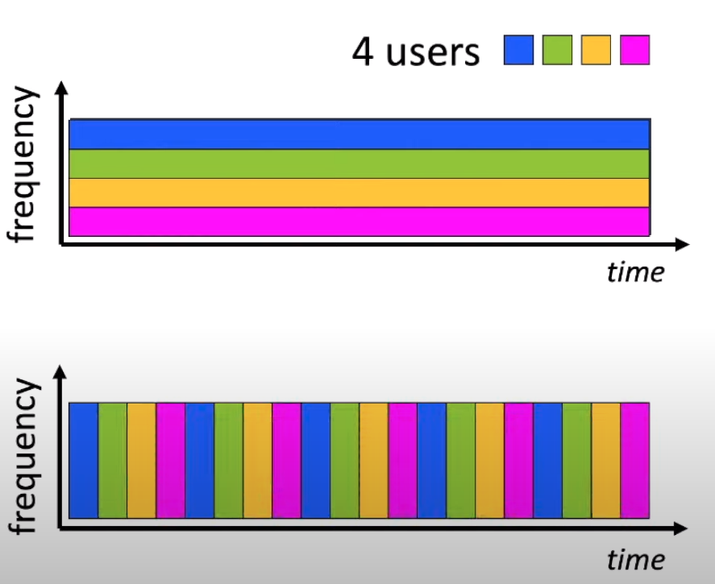

##### Frequency Division Multiplexing
- frequencies divided into frequency bands
- each call allocated its own band, can transmit at max rate of that band

##### Time Division Multiplexing (TDM)
- time divided into slots
- each call allocated periodic slot(s), can transmit at maximum rate of frequency band only during its time slot(s)

### Packet switching vs circuit switching
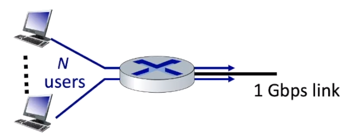

Example:
- 1 Gb/s link
- each user:
  - 100 Mb/s when "active"
  - active 10% of time

Q: how many users can use this network under circuit-switching and packet switching?

- circuit-switching: 10 users
- packet switching: with 35 users, probability of > 10 active at same time is less than 0.004

#### Is packet switching a winner?
- great for "bursty" data - sometimes has data to send, but at other times not
  - resource sharing
  - simpler, no call setup
- **excessive congestion possible**: packet delay and loss due to buffer overflow
  - protocols needed for reliable data transfer, congestion control
- **Q: How to provide circuit-like behavior with packet-switching?**
  - It's complicated. There are various techniques that try to make packet switching as "circuit-like" as possible.

### Internet structure: a *network of networks*

- On the edge of the internet there are *access networks*.
- They are interconnected via global ISP (global backbone networks)
  - There are multiples of them because they are competitors
- Global ISP are connected using peering links
  - Locations where they are connected are called IXP: Internet exchange points
- Lots of access nets are connected to **regional ISP** first.
- There also exist **Content provider network**
  - Google, Microsoft, etc, run their own global networks to bring their content close to the end users.

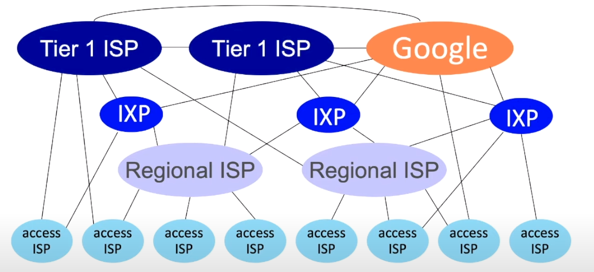

At *center*: small number of well-connected large networks
- tier-1 commercial ISPs (e.g., Level 3, Sprint, AT&T, NTT), national & international coverage
- content provider networks (e.g., Google, Facebook): private network that connects its data centers to Internet, often bypassing tier-1, regional ISPs

### Overview of the Network core:
- forwarding, routing
- packet switching
  - store-and-forward
  - queueing delays
  - packet loss
- circuit switching
  - vs packet switching
- structure of today's internet
  - network of networks

## 1.4. Performance
### How do packet delay and loss occur?
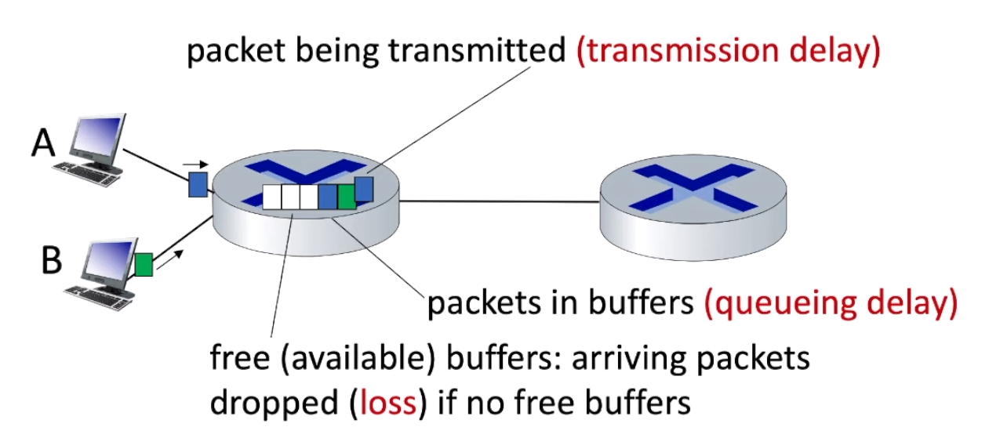

- packets **queue** in route buffers, waiting for turn for transmission
  - queue length grows when arrival rate to link (temporarily) exceeds output link capacity
- packet **loss** occurs when memory to hold queued packets fills up

### Packet delay: four sources
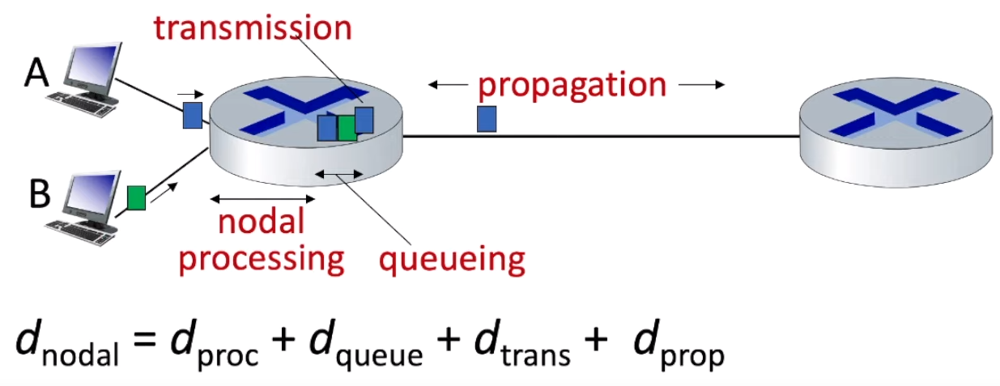

#### nodal processing
- check bit errors
- determine output link
- typically < microsecs

#### queueing delay
- time waiting at output link for transmission
- depends on congestion level of router

#### transmission delay
The amount of time for the packet to be pushed into the outgoing link
- *L*: packet length (bits)
- *R*: link transmission rate (bps)
- *d_trans = L / R*

#### propagation delay
- *d*: length of physical link
- *s*: propagation speed (~2 x 10^8 m / sec)
- *d_prop = d / s*

Real world analogy:
- time for a car to go through a toll booth = transmission delay
- time for a car to travel between two toll booths = propagation delay

### Packet queueing delay (revisited)
- *a*: average packet arrival rate
- *L*: packet length (bits)
- *R*: link bandwidth (bit transmission rate)

*L * a / R = arrival rate of bits / service rate of bits = **traffic intensity***

- *La/R ~ 0*: avg. queueing delay small
- *La/R -> 1*: avg. queueing delay large
- *La/R > 1*: average delay infinite!

*Personal remark:*
One may wonder why the queueing delay is large when the intensity = 1.
- looks like if 5 persons come and 5 persons are serviced each minute, then there should be no queue.

But imagine there are already 10 people in the queue waiting for their doctor appointment.
Then if the traffic intensity = 1, the queue will never disappear.

### Real Internet delays and routes
#### Traceroute program
Provides **delay** measurement from **source** to **router** **along end-end Internet path** towards **destination**.

For all i:
- sends three packets that will reach router i on path towards destination (with time-to-live field value of i)
- router i will return packets to sender
- sender measures time interval between transmission and reply

### Packet loss
- queue (aka buffer) preceding link has finite capacity
- packet arriving to full queue dropped (aka lost)
- lost packet may be retransmitted by previous node, by source end system, or not at all

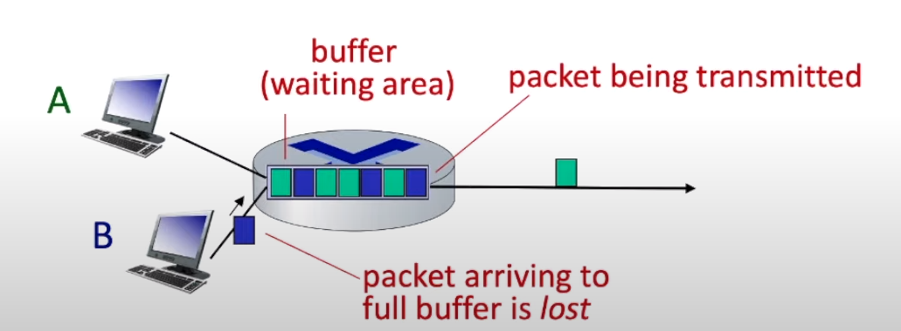

### Throughput
- **throughput**: rate (bits/time unit) at which bits are being sent from sender to receiver
  - **instantaneous**: rate at given point in time
  - **average**: rate over longer period of time

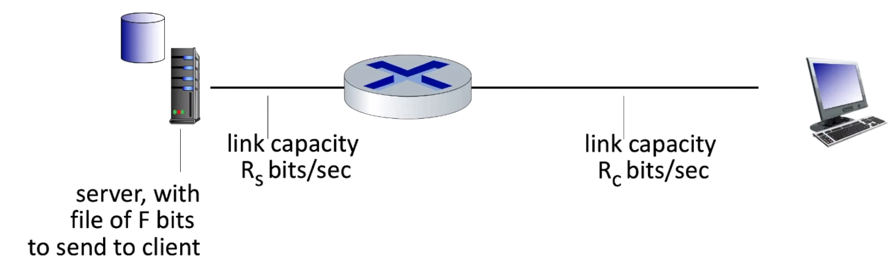

#### Water pipes analogy
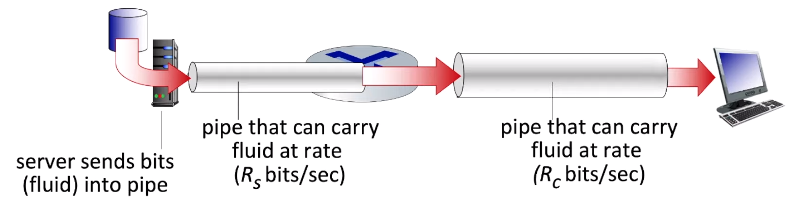

#### bottleneck link
link on end-end path that constrains end-end throughput

#### Throughput: network scenario
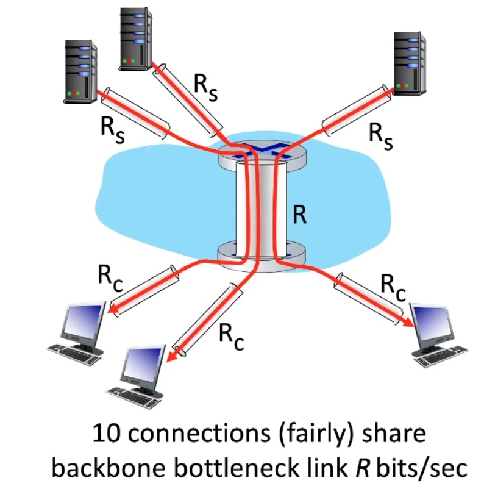

- per-connection end-end throughput: *min(R_c, R_s, R/10)*
- in practice: *R_c* or *R_s* is smaller than *R/N*
  - bottleneck link is at network edge

### Overview of network performance
- Two aspects of network performance:
- delay
  - 4 components of delay
  - traceroute
- throughput

## 1.5. Layering, encapsulation, service models
### Analogy
Organization of air travel.

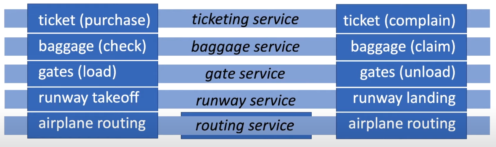

**layers**: each layer implements  service
  - via its own internal-layer actions
  - relying on services provided by layer below

### Why layering?
Approach to designing/discussing complex systems:
- explicit structure allows identification, relationship of system's pieces
  - layered **reference model** for discussion
- modularization eases maintenance, updating of system
  - change in layer's service implementation: transparent to rest of system
  - e.g., change in gate procedure doesn't affect rest of system

### Layered Internet protocol stack
|             |
|-------------|
| application |
| transport   |
| network     |
| link        |
| physical    |

- **application**: supporting network applications
  - HTTP, IMAP, SMTP, DNS
- **transport**: process-process data transfer
  - TCP, UDP
- **network**: routing of datagrams from source to destination
  - IP, routing protocols
- **link**: data transfer between neighboring network elements
  - Ethernet, 802.11 (WiFi), PPP
- **physical**: bits *on the wire*

#### Application
**Application** exchanges **messages** M to implement some application service using *services* of transport layer

#### Transport
**Transport-layer** protocol transfers M (e.g., reliably) from one *process* to another, using services of network layer.
- transport-layer protocol **encapsulates** application-layer message, M, with *transport* layer-layer header H_t to create a transport-layer **segment**
  - H_t used by transport layer protocol to implement its service

#### Network
**Network-layer** protocol transfers transport-layer segment (H_t M) from one *host* to another, using link layer services.
- network-layer protocol **encapsulates** transport-ayer segment (H_t M) with network layer-layer header H_n to create a network-layer **datagram**
  - H_n used by network layer protocol to implement its service

#### Link
**Link-layer** protocol transfers datagram (H_n (H_t M)) from *host* to neighboring *host*.
- link-layer protocol ... with link-layer header H_l to create a link-layer **frame**.

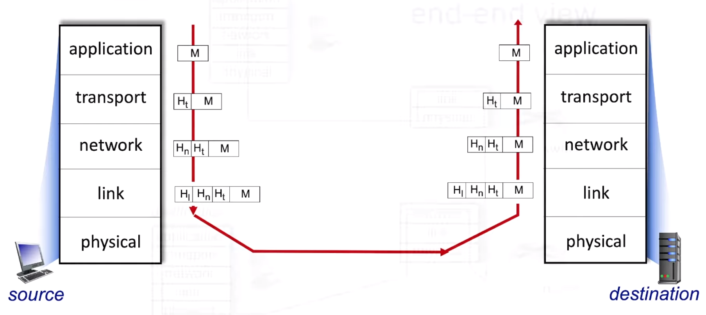

### Encapsulation: an end-end view
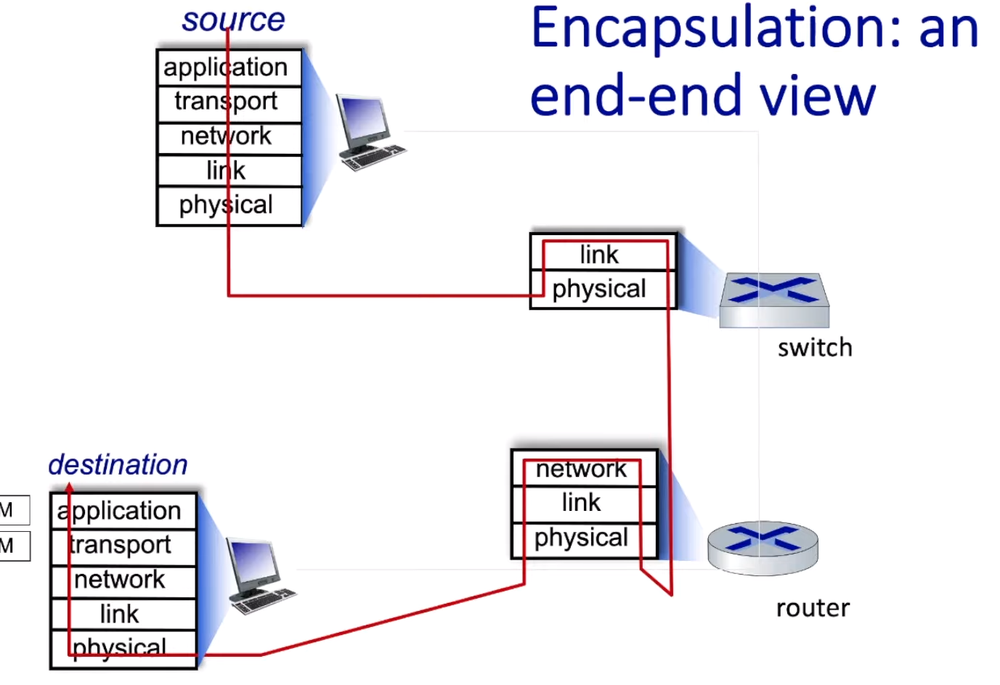

### Overview
- architectural layering
- Internet layers
- encapsulation
  - taking information from higher layer
  - wrapping a header around it to implement the service
  - passing it down to a lower layer

## 1.6. Networks Under Attack

### Network security
- Internet not originally designed with (much) security in mind
  - original vision: a group of mutually trusting users attached to a transparent network
  - Internet protocol designers playing "catch-up"
  - security considerations in all layers
- **We now need to think about:**
  - how bad guys can attack computer networks
  - how we can defend networks against attacks
  - how to design architectures that are immune to attacks

### Bad guys
#### Packet "sniffing" (packet interception)
- broadcast media (shared Ethernet, wireless)
- promiscuous network interface reads/records all packets passing by

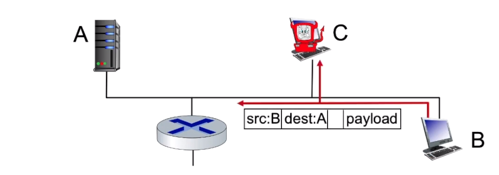

#### Packet "spoofing" (fake identity)
**IP spoofing**: injection of packet with false source address.

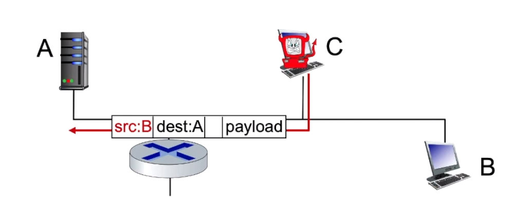

#### Denial of Service (DoS)
Attackers make resources (server, bandwidth) unavailable to legitimate traffic by overwhelming resource with bogus traffic.

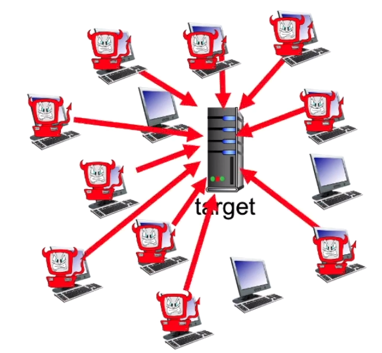

1. select target
2. break into hosts around the network (see botnet)
3. send packets to target from compromised hosts

### Lines of defense
- **authentication**: proving you are who you say you are
  - cellular networks provides hardware identity via SIM cars; no such hardware assist in traditional Internet
- **confidentiality**: via encryption
- **integrity checks**: digital signatures prevent/detect tampering
- **access restrictions**: password-protected VPNs
- **firewalls**: specialized "middleboxes" in access and core networks:
  - off-by-default: filter incoming packets to restrict senders, receivers, applications
  - detecting/reacting to DOS attacks

### Overview of Network security
- What can bad actors do?
- What defenses designed, deployed?
